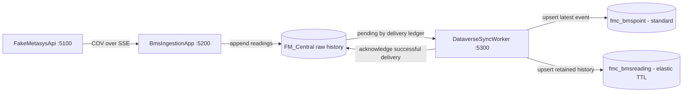

# Mermaid diagrams

Use a Mermaid fenced block when a diagram materially clarifies architecture,
ordered interactions, lifecycle or relationships. Do not add one for a single
fact or a short list that already explains the result.

Choose flowchart for components/data movement, sequenceDiagram for ordered
requests, stateDiagram-v2 for lifecycle and erDiagram for real data relations.
Use short stable IDs, quoted descriptive labels and edges labeled with the
operation/protocol. Avoid reserved keywords as identifiers.

## Project baseline example

Use the [project reference](../dv-overview/references/project.md) when adapting
this example. A shared object_id does not by itself establish a Dataverse lookup
relationship. Show external network/trust boundaries only when established by
the architecture.

## Verification and delivery

Keep one main idea per diagram. Match arrows, sequence and cardinality to the
code or stated proposal, and label proposed components. Check Mermaid syntax and
render when the available viewer/renderer supports it. If no renderer is
available, state that limitation rather than claiming visual verification.

Keep editable source in the document. Export SVG/PNG if the user's destination
needs it. Update existing diagrams when the task changes their meaning; do not
rewrite unrelated README diagrams merely because this skill was loaded.
