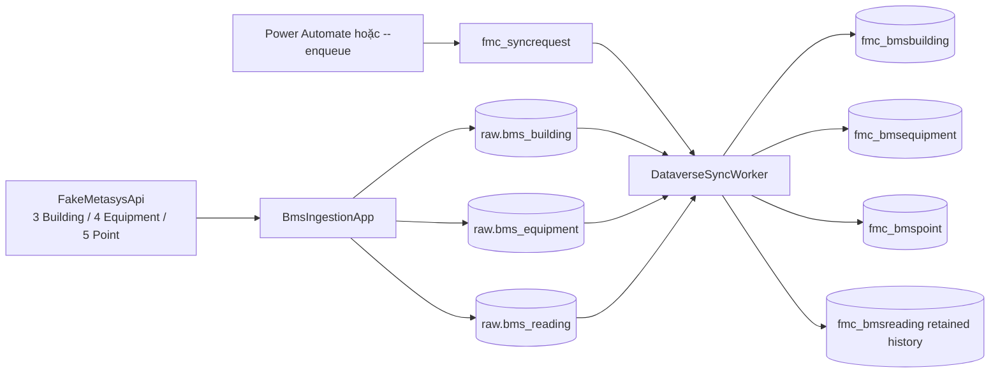

# Kế hoạch và trạng thái triển khai full flow BMS catalog

Ngày cập nhật: **2026-09-09**. Trạng thái: **đã triển khai và kiểm chứng trên Developer environment**.

## Mục tiêu

Mở rộng dữ liệu giả lập thành ba thực thể nghiệp vụ và giữ cùng một chuỗi xử lý:

Ba bảng chính để demo quan hệ là Building, Equipment và Point. `fmc_bmsreading` vẫn là bảng history kỹ thuật theo thiết kế cũ.

## Dữ liệu fixture

| Building | Equipment | Point |
| --- | --- | --- |
| `BLDG-A` | `EQ-A-WM-001` | `WATER-001` |
| `BLDG-A` | `EQ-A-TS-001` | `TEMP-001` |
| `BLDG-B` | `EQ-B-WM-002` | `WATER-002` |
| `BLDG-TEST` | `EQ-TEST-RIG-001` | `TEST-POWER-AUTOMATE-001` |
| `BLDG-TEST` | `EQ-TEST-RIG-001` | `TEST-POWER-AUTOMATE-002` |

Quan hệ: `Building 1:N Equipment 1:N Point`. Hai Point test cùng trỏ vào một TestRig để nhìn rõ quan hệ 1:N.

## Phần đã triển khai

- Fake API có `GET /api/metasys/buildings`, `GET /api/metasys/equipment` và `GET /api/metasys/objects`; COV event mang `equipmentCode`.
- Ingestion đọc cả ba endpoint, upsert catalog theo transaction, rồi lưu COV vào `raw.bms_reading`.
- SQL có `raw.bms_building`, `raw.bms_equipment`, `raw.bms_reading.equipment_code`; script migration và seed đều chạy lại an toàn.
- Worker đọc SQL catalog ở đầu mỗi batch, upsert Building → Equipment → Point, rồi ghi retained history và acknowledge ledger.
- Cùng một `fmc_syncrequest` xử lý catalog và readings; cutoff và per-row delivery ledger vẫn được giữ.
- Dataverse có hai bảng standard mới, hai alternate key, hai lookup Restrict Delete, form, subgrid, public view và quyền runtime.
- Source solution sau export nằm trong `dataverse/FMCentralBms`.

## Bằng chứng triển khai 2026-09-09

- Target: `https://org06cbc9ec.crm5.dynamics.com/`, organization `ab191700-b99e-f111-aaa0-000d3a80bb96`, solution `FMCentralBms`.
- Ingestion status: `Listening`, upsert 3 Building, 4 Equipment và nhận COV của 5 Point.
- SQL: 3 Building, 4 Equipment, 5 Object ID có mapping.
- Sync request `c99f3d86-1fac-f111-aaad-00224819a344`: `Succeeded`, cutoff `23377`, dead-letter `0`.
- Verify live: đủ 5 join Point → Equipment → Building và 25/25 history sample khớp SQL.
- COV tiếp tục phát sau cutoff sẽ nằm trong request kế tiếp; đây là hành vi mong đợi.

## Tiêu chí hoàn tất

- Build solution thành công.
- Self-test dùng SQL database tạm pass, database được xóa sau test.
- API, ingestion status và SQL counts khớp 3/4/5.
- Trigger thật đạt trạng thái cuối `Succeeded`.
- Verify live metadata, catalog, lookup và history pass.

## Giới hạn

Dữ liệu là fixture của FakeMetasysApi, chưa chứng minh kết nối đến Johnson Controls Metasys thật. SQL vẫn là system of record cho full history; Dataverse history có TTL.
