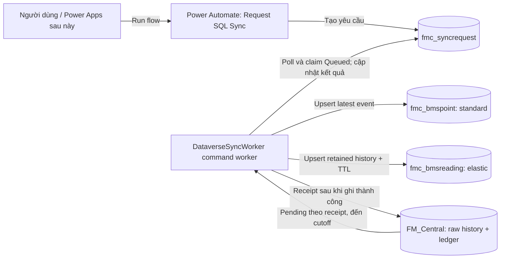

# Plan: Power Automate trigger cho SQL → Dataverse

Ngày cập nhật: 2026-09-08. Trạng thái: **pilot đã triển khai trong Developer environment;
Windows Service production chưa cài vì chưa có application identity/certificate runtime**.

## Implementation receipt

- Đã provision `fmc_syncrequest`, alternate key, views, runtime/requestor roles.
- Đã tạo connection reference `fmc_sharedcommondataserviceforapps`, environment variable
  `fmc_SyncPipeline` và activate flow `FMC - Request SQL to Dataverse Sync`
  (`6fa6c13a-3eab-f111-aaad-00224819a344`) trong solution `FMCentralBms`.
- Worker đã có `CommandDriven`, atomic claim bằng row version, lease/heartbeat,
  cutoff, bounded execution, recovery/requeue và Windows Service hosting support.
- End-to-end 2026-09-08: request `b4d35f3c-3fab-f111-aaad-00224819a344` xử lý
  183 dòng trong 2 batch đến cutoff 7404, `Succeeded`, 0 pending và 0 dead-letter;
  sau đó 25 mẫu history mới nhất được đối soát thành công.
- Flow được Power Automate validator chấp nhận và ở trạng thái Activated. Chưa
  thực hiện một manual button run qua UI vì môi trường agent không có browser session;
  cùng đường queue/worker đã được kiểm thử bằng request live nêu trên.
- Source solution đã export/sync về `dataverse/FMCentralBms`. Một bảng
  `cr3c8_fmc_silver_bmspoint` đã có sẵn trong live solution từ dataflow khác và
  được giữ nguyên; nó không thuộc implementation trigger này.

## 1. Mục tiêu và phạm vi

Người dùng chỉ cần bấm một cloud flow trong Power Automate để yêu cầu đồng bộ.
Hệ thống tự lấy dữ liệu SQL còn thiếu, xử lý nhiều batch, ghi sang Dataverse và
công bố kết quả; không cần nhờ assistant hoặc gọi API từng batch. Sau đó có thể
thêm lịch tự động và nút trong Power Apps dùng chung cơ chế.

Power Automate điều phối yêu cầu. `DataverseSyncWorker` tiếp tục xử lý dữ liệu
theo hợp đồng hiện có; SQL là nơi giữ raw/full history. Không thay thế ingestion,
không tạo flow cho từng reading, không đưa toàn bộ lịch sử SQL lên Dataverse.

### Baseline đã có

- Worker .NET hỗ trợ chạy liên tục, `--run-once` một batch và `--verify` đọc/đối soát mẫu.
- SQL `FM_Central.raw.bms_reading` cùng delivery ledger, dead-letter và SQL application lock.
- Solution `FMCentralBms`: `fmc_bmspoint` standard và `fmc_bmsreading` elastic với TTL.
- [Launcher và runbook](../runbooks/sql-to-dataverse-runbook.vi.md) chạy trên máy hiện tại.
- Đã có bảng request, activated cloud flow và command-driven code. Windows Service
  chưa đăng ký vì production identity/certificate và quyền SQL của service account chưa sẵn sàng.

Nguồn baseline: [hợp đồng implementation](../reference/dataverse-deployment.md),
[Program.cs](../../DataverseSyncWorker/Program.cs),
[SyncOptions.cs](../../DataverseSyncWorker/Models/SyncOptions.cs),
[SyncEngine.cs](../../DataverseSyncWorker/Services/SyncEngine.cs) và
[SqlStore.cs](../../DataverseSyncWorker/Services/SqlStore.cs).
[Plan 3.0](plan-3.0-sql-to-dataverse.md) chỉ là thiết kế lịch sử.

## 2. Kiến trúc đề xuất



Worker chạy thường trực trên máy có kết nối SQL và chủ động gọi Dataverse qua
HTTPS. Power Automate không trực tiếp bật `.exe` trên máy. Nếu máy hoặc service
offline, request ở `Queued` cho đến khi worker có thể nhận việc.

Thiết kế này không cần mở cổng 5300 ra Internet hoặc gateway cho đường điều phối:
flow chỉ làm việc với Dataverse, còn worker truy cập SQL từ mạng của nó. Vẫn phải
kiểm tra DNS, firewall/proxy và kết nối outbound thực tế trước triển khai.

### Quyết định về Azure Function App

**Không cần tích hợp hoặc migrate sang Azure Function App trong phase 1.** Code
hiện tại là .NET worker có SQL application lock, delivery ledger, deterministic
upsert và cần truy cập SQL nội bộ liên tục. Đưa nó lên Function App lúc này sẽ
thêm bài toán network/private SQL, hosting, identity, scale/concurrency và vận
hành mà không tạo thêm khả năng cần thiết cho trigger Power Automate. Vì vậy
Power Automate chỉ enqueue request trong Dataverse; worker/Windows Service vẫn là
consumer duy nhất.

Azure Function App chỉ là phương án thay thế ở phase sau nếu có quyết định chuyển
runtime sang Azure. Khi đó phải làm một migration riêng: đóng gói worker thành
Function/isolated worker, thiết kế kết nối SQL private (VNet hoặc hybrid network),
managed identity/application user, storage/lease thay cho cơ chế hiện tại, giới
hạn concurrency để không phá SQL application lock, Application Insights, retry,
deployment slots và rollback. Không chạy đồng thời Windows Service và Function
consumer trên cùng pipeline nếu chưa có cơ chế claim/lease chung.

Nếu backlog cần workflow kéo dài nhiều giờ/ngày hoặc fan-out lớn, Durable Functions
là lựa chọn cần đánh giá vì có checkpoint, retry và khôi phục state; đây là suy luận
kiến trúc, không phải yêu cầu của POC hiện tại. Tài liệu Microsoft mô tả Durable
Functions cho workflow stateful, long-running và recovery ([Durable Functions overview](https://learn.microsoft.com/en-us/azure/durable-task/durable-functions/durable-functions-overview)).

## 3. Các thành phần cần xây dựng

### 3.1. Bảng điều phối `fmc_syncrequest`

Thêm standard table vào solution `FMCentralBms`. Các tên cột dưới đây là đề xuất,
cần cập nhật provisioning, role, views và export solution khi triển khai.

| Trường / nhóm | Ý nghĩa |
| --- | --- |
| `fmc_name`, `fmc_command` | Tên request; phase 1 chỉ cho phép `DrainPending` |
| `fmc_pipeline` | Phạm vi organization + SourceId, không nhận SQL hoặc URL tùy ý từ người dùng |
| `fmc_status` | `Queued`, `Running`, `Succeeded`, `CompletedWithIssues`, `Failed` |
| `fmc_correlationid` | Mã đối chiếu flow, request và worker log; dùng lại khi retry cùng một submission |
| `fmc_requestedby` | Danh tính người yêu cầu lấy từ ngữ cảnh trigger đáng tin cậy |
| `fmc_requestedcutoffid` | SQL MAX(id) tại lần worker nhận đầu tiên; lưu dạng text để bảo toàn SQL bigint |
| `fmc_startedat`, `fmc_completedat` | Thời điểm UTC |
| `fmc_batches`, `fmc_deliveredrows`, `fmc_quarantinedrows` | Tiến độ trong phạm vi request, không cộng trùng khi retry/restart |
| `fmc_pendingafter`, `fmc_deadletterafter` | Số liệu còn lại trong phạm vi cutoff; trạng thái toàn pipeline báo riêng |
| `fmc_errormessage` | Lỗi đã loại bỏ secret/token và thông tin không cần thiết |
| Claim/lease metadata | Worker owner, heartbeat, lease expiry và số lần thử để phục hồi khi process chết |

Các bộ đếm tích lũy cũng phải chọn kiểu lưu trữ tránh tràn 32-bit khi quy mô tăng.
`CreatedOn`/`CreatedBy` phục vụ audit nền tảng; `CreatedBy` có thể là tài khoản của
connection chứ không phải người bấm flow. Không dùng nó thay thế danh tính requester.

### 3.2. Instant cloud flow

Tên đã triển khai: `FMC - Request SQL to Dataverse Sync`.

1. Trigger `Manually trigger a flow`; người dùng chỉ cần Run, không nhập câu SQL hay credentials.
2. Xác định pipeline được cấu hình và correlation ID của submission.
3. Tra request `Queued`/`Running` cùng pipeline. Nếu có, cung cấp ID đang hoạt động để theo dõi.
4. Nếu chưa có, tạo request `Queued` rồi cung cấp ID/link theo dõi trong output của flow.
5. Kết thúc sớm; không chờ worker xử lý hết backlog trong cùng flow run.

Flow nằm trong solution, sử dụng Dataverse connection reference và environment
variables cho cấu hình theo environment. Đây là mẫu ALM solution-aware được
Microsoft hướng dẫn; credentials không lưu trong environment variables dạng text.
Xem [solution-aware flows](https://learn.microsoft.com/en-us/power-automate/guidance/coding-guidelines/understand-benefits-solution-aware-flows).

Kiểm tra rồi tạo không phải thao tác atomic. Phase 1 cần serialize trigger của
flow và chặn submission trùng bằng correlation key. Worker vẫn phải claim atomic
và serialize theo pipeline để chịu được retry hoặc producer khác. Nếu thêm
Recurrence/Power Apps, dùng chung đường enqueue có cơ chế serialize/deduplicate;
không dựa vào hai flow riêng cùng kiểm tra trước khi tạo. Bảo đảm tối đa một
request `Running` mỗi pipeline; request trùng phải được liên kết/coalesce rõ ràng.

### 3.3. Mở rộng worker với `CommandDriven`

Cấu hình đã được code hỗ trợ và đang dùng cho pilot:

```json
{
  "ExecutionMode": "CommandDriven",
  "CommandPollIntervalSeconds": 10,
  "CommandMaxDurationMinutes": 15
}
```

10 giây poll và 15 phút mỗi lượt là giá trị khởi điểm để thử nghiệm, chưa phải SLA.
Chế độ mặc định hiện là command-driven và chỉ đồng bộ khi có request. Continuous
vẫn có thể cấu hình để rollback/chẩn đoán; không chạy cả hai mode trên cùng pipeline.

Trình tự xử lý:

1. Kiểm tra đúng organization và cấu hình runtime; lấy request Queued cũ nhất của pipeline.
2. Claim `Running` bằng optimistic concurrency/lease; giữ cơ chế khóa pipeline để nhiều process không nhận việc trùng.
3. Chụp và lưu SQL MAX(id) làm cutoff một lần; giữ nguyên cutoff khi phục hồi cùng request.
4. Lấy các dòng thiếu receipt với `id <= cutoff`, loại riêng dead-letter chưa xử lý. Bổ sung tham số cutoff cho SQL query; không thay bằng watermark-only.
5. Gọi engine hiện có cho từng batch: validate → current point → history còn TTL → receipt. Duy trì SQL application lock và local serialization.
6. Cập nhật tiến độ, heartbeat, retry có giới hạn và kiểm tra quyền sở hữu lease trước batch tiếp theo.
7. Khi không còn pending đủ điều kiện trong cutoff, kết thúc với trạng thái phản ánh cả dead-letter.

`Succeeded`: không còn pending/dead-letter trong phạm vi tại lần kiểm tra cuối.
`CompletedWithIssues`: đã xử lý hết các dòng hợp lệ, vẫn có dead-letter trong phạm vi.
`Failed`: lỗi không thể hoàn thành như SQL/auth/schema/permission; giữ nguyên ledger
và ghi lỗi để người vận hành xử lý. Empty run hợp lệ có kết quả thành công với 0 dòng.

Đề xuất khi hết thời lượng mỗi lượt: trả request về `Queued` với cùng cutoff và
tiến độ, tự tiếp tục ở lượt sau; không báo thành công khi vẫn còn pending. Lease
hết hạn sau crash chỉ được reclaim an toàn khi đã kiểm tra ownership và khóa SQL.
Nếu Dataverse không truy cập được thì có thể chưa cập nhật được trạng thái lỗi:
ghi log local và phục hồi trạng thái sau reconnect, không giả định cập nhật đã thành công.

Cutoff giới hạn các dòng delivery của request, không phải snapshot SQL tuyệt đối.
Transaction commit muộn với ID thấp sẽ được ledger phát hiện ở lần kiểm tra/lần
request sau; dữ liệu trên cutoff chờ request tiếp theo. Current point vẫn lấy
latest event theo hợp đồng hiện có, có thể phản ánh reading mới hơn cutoff.
Không được làm lùi trạng thái point để khớp một batch backfill.

### 3.4. Windows Service và danh tính vận hành

- Host đã hỗ trợ Windows Service và có installer
  [`Install-DataverseSyncService.ps1`](../../scripts/Install-DataverseSyncService.ps1);
  chỉ chạy installer khi có application ID/certificate và đã chuẩn bị quyền SQL/private key.
- Tài khoản service có quyền SQL cần thiết, đọc cấu hình và private key certificate trong certificate store phù hợp.
- Dataverse dùng Entra application + application user với certificate; tắt đường Developer token cho service và xác minh actual caller.
- Cấu hình Automatic startup, restart recovery và log có correlation ID; quy định rotation/retention log và certificate renewal.
- Service không phụ thuộc phiên Windows đăng nhập hay Azure CLI cá nhân. Giữ launcher developer hiện có.

Việc tạo identity, gán role, cài service và triển khai cloud là các bước triển khai
sau khi được duyệt, không phải tác động của việc lưu plan này.

### 3.5. Phân quyền và quan sát

| Danh tính | Quyền dự kiến |
| --- | --- |
| Người dùng | Run flow; đọc request được phép xem qua view/app |
| Flow connection | Create/Read request; không cần quyền ghi readings |
| Worker application user | Read/Write request và quyền runtime hiện có cho hai bảng BMS |
| Deployment identity | Thay đổi metadata/solution/role trong bước triển khai riêng |

Chốt ownership và phạm vi truy cập của bảng request trước khi cấp quyền. Không
gán System Administrator cho worker. Kiểm tra quyền chạy flow thực tế, connection
được sử dụng, DLP, license và request capacity của tenant; chưa có bằng chứng
license production đã đáp ứng. Xem [Power Automate licensing FAQ](https://learn.microsoft.com/en-us/power-platform/admin/power-automate-licensing/faqs).

Tạo views: đang chờ/đang chạy, thất bại, hoàn tất có lỗi và thành công gần đây.
Hiển thị request ID, cutoff, thời gian, số dòng và lỗi; cảnh báo request nằm Queued
quá lâu hoặc Running mất heartbeat. Kênh Teams/email chỉ triển khai khi đã chốt
người nhận và phạm vi thông báo. Chốt retention cho request/log, không xóa raw SQL.

## 4. Thứ tự triển khai và sản phẩm bàn giao

| Bước | Việc thực hiện | Bàn giao / điều kiện qua bước |
| --- | --- | --- |
| 1 | Chốt môi trường, host luôn bật, identity, DLP/license và mục tiêu độ trễ | Checklist triển khai và cấu hình không chứa secret |
| 2 | Thêm request table, keys, views, role vào provisioning và solution | Metadata được kiểm tra, solution export/unpack cập nhật |
| 3 | Thêm command processor, cutoff query, claim/lease, recovery và counters | Worker cùng test automated; giữ nguyên hợp đồng delivery |
| 4 | Tạo instant flow trong solution và connection reference | Run flow tạo/coalesce request, trả ID nhanh |
| 5 | Publish/cài Windows Service trong environment được duyệt | Tự khởi động lại, đúng identity, log có thể tra cứu |
| 6 | Kiểm thử end-to-end và đối soát | Evidence theo ma trận bên dưới, không chỉ dựa vào flow xanh |
| 7 | Cập nhật runbook setup/run/recovery, export solution và cấu hình triển khai | Quy trình một nút cho người dùng, SOP xử lý lỗi cho vận hành |

Artifacts code dự kiến: mở rộng `SyncOptions`, `Program`, `SqlStore`,
`DataverseProvisioner`; thêm command processor/repository; test và script service
trong thư mục tương ứng. Tên file mới chốt lúc implementation. Không chỉnh mapping
GUID, SourceId, timestamp hoặc retention để phục vụ riêng flow.

## 5. Ma trận nghiệm thu

| Tình huống | Kết quả cần chứng minh |
| --- | --- |
| Backlog nhiều hơn một batch | Một request tự drain các dòng hợp lệ đến cutoff, không cần bấm cho từng batch |
| Không có pending | Succeeded, 0 dòng mới; không tạo bản sao |
| Bấm lặp / flow retry / nhiều producer | Submission trùng được coalesce; tối đa một Running/pipeline và không đồng bộ song song |
| Worker offline | Request ở Queued, nhận việc sau khi online; có cách phát hiện chờ quá lâu |
| Dataverse throttle/lỗi tạm thời | Retry/backoff; không ghi receipt trước khi remote writes cần thiết thành công |
| Crash sau ghi Dataverse, trước receipt | Reclaim/replay an toàn, GUID/partition ổn định, không tạo duplicate |
| Dòng không hợp lệ | Dead-letter có nguyên nhân, raw SQL giữ nguyên, CompletedWithIssues |
| SQL/auth/schema/quyền lỗi | Không báo thành công, ledger giữ nguyên; trạng thái/log chỉ ra lỗi, phục hồi được |
| SQL phát sinh mới và commit muộn ID thấp | Request kết thúc theo phạm vi đã định; request sau không bỏ sót do watermark |
| Windows restart / request Running mất heartbeat | Service tự bật, reclaim an toàn, giữ cutoff và không cộng trùng counters |
| Hết thời lượng một lượt | Tự tiếp tục cùng request, không báo Succeeded khi còn pending |
| Sai organization hoặc người dùng không đủ quyền | Chặn đúng phạm vi; không ghi nhầm environment |
| History quá TTL và replay cũ | Không gia hạn TTL hoặc làm lùi current point; receipt đúng hợp đồng |

Đối soát bằng ledger, request state, worker log và mẫu Dataverse. `--verify` hiện
có chỉ đối soát tối đa 25 mẫu history còn TTL, không phải chứng nhận toàn bộ dữ
liệu, throughput hay production readiness. Số backlog của lần kiểm tra cũ không
được dùng làm số liệu live hoặc acceptance target cố định.

## 6. Triển khai an toàn và rollback

1. Ghi nhận phiên bản worker/solution/cấu hình và baseline ledger trước thay đổi; kiểm tra target environment.
2. Triển khai schema additive, worker rồi flow; kiểm thử có kiểm soát trước khi bật cho người dùng.
3. Khi chuyển sang command-driven, dừng instance continuous cùng pipeline để trạng thái request phản ánh đúng người xử lý.
4. Nếu lỗi, tắt producer flow/Recurrence, dừng command worker an toàn và giữ request/ledger/log để điều tra.
5. Có thể quay lại worker continuous đã kiểm chứng với cấu hình cũ sau khi chắc chắn không còn command worker xử lý. Ghi chú các request còn treo, không tự đánh dấu thành công.
6. Không rollback bằng xóa raw SQL, reset receipt, đổi SourceId hoặc xóa bảng Dataverse. Schema mới có thể giữ lại nhưng không sử dụng cho đến khi có phương án riêng.

## 7. Phase 2 và các phương án chưa chọn

Sau khi phase 1 ổn định, thêm `FMC - Scheduled SQL Sync` với Recurrence qua cùng
đường enqueue. Chu kỳ 5 phút là đề xuất để đánh giá độ trễ, tải và license, không
phải SLA đã được duyệt. Có thể thêm nút Power Apps/model-driven và trang xem
request; app không cần giữ một lời gọi mở cho đến khi đồng bộ xong.

Chưa chọn SQL connector + một action cho mỗi reading vì phải xây lại mapping,
receipt/replay và làm số action phụ thuộc số dòng. Chưa chọn custom connector gọi
API localhost vì cần thiết kế hosting, network và authentication riêng; endpoint
run-once hiện tại chỉ chạy một batch và chỉ có trong Development.

Nếu sau này chọn API connector, thiết kế job bất đồng bộ và status polling thay
vì giữ HTTP chờ hết backlog. Microsoft mô tả giới hạn chờ synchronous và mẫu
202/Location trong [asynchronous flow patterns](https://learn.microsoft.com/en-us/power-automate/guidance/coding-guidelines/asychronous-flow-pattern).

## 8. Quyết định cần chốt trước triển khai

- Máy/VM nào luôn bật, tài khoản service và người quản lý certificate là ai?
- Dùng environment Developer hiện tại cho pilot; production cần xác nhận environment, license/capacity và DLP riêng.
- Nhóm người được Run/xem kết quả, connection owner và phạm vi request visibility.
- Ngưỡng chờ/cảnh báo, thời lượng mỗi lượt, lease/retry, retention log/request và SLA thực tế.
- Phase 1 chỉ manual trigger; Recurrence và Power Apps là bước mở rộng sau nghiệm thu, trừ khi phạm vi được điều chỉnh.

Kết quả đích: **Run flow → Dataverse nhận request → Windows Service tự đồng bộ SQL
→ người dùng xem kết quả trong Power Platform**, không cần yêu cầu assistant vận hành mỗi lần.

## Ghi chú kiểm tra tài liệu

Đã đối chiếu baseline với code, build Release, chạy self-test và thực hiện ca
end-to-end live ghi trong implementation receipt. Sơ đồ giữ dạng source có thể
chỉnh sửa; chưa render hình ảnh vì môi trường hiện tại không có Mermaid CLI trên PATH.
Các ca lỗi/offline/restart và cài Windows Service production vẫn cần thực hiện sau
khi có runtime identity, certificate và service account được duyệt.
