# Plan: thông báo file SharePoint đổi và tự đồng bộ sau 5 phút

Trạng thái: **đề xuất, chưa implement/deploy**. Ngày lập: 2026-09-23.
Phạm vi: `FMC BMS Demo` trong Developer environment, solution `FMCentralBms` (prefix `fmc`).

## 1. Kết quả cần đạt

Khi một file `.xlsx` được hỗ trợ trong `FMC-Inbox` thay đổi, người đang mở trang Home của app thấy tên file, thời điểm phát hiện, thời hạn tự chạy và nút **Sync now**. Nếu không ai bấm, Power Automate gọi đồng bộ sau 5 phút. Cả hai đường đều dùng pipeline SharePoint → `fmc_spofile` → local SPO watcher → các bảng BMS hiện có. Không coi việc flow nhận yêu cầu hay archive file là import đã hoàn tất.

Mốc 5 phút được tính từ `detectedAtUtc` khi flow phát hiện ghi thành công vào Dataverse, không cam kết đúng 5 phút tính từ lần Save trên SharePoint. Trigger, connector, lịch chạy và worker đều có độ trễ; đo các mốc riêng trong receipt.

## 2. Baseline đã có

| Thành phần | Hiện trạng từ repo | Tái sử dụng |
| --- | --- | --- |
| `FMC BMS Demo` | Home là generative page React/TypeScript; đã đọc `fmc_spofile` nhưng chỉ refresh theo thao tác người dùng | Thêm query riêng cho thay đổi chờ, banner và polling khi Home đang mở |
| `fmc_RequestSpoSync` | Custom API phát business event | Giữ entry point sync hiện có |
| `FMC - Request SPO Sync` | Flow quét `FMC-Inbox`, dùng source key và ETag, archive version đổi vào `fmc_spofile` | Giữ bước quét/archive; bổ sung cách lọc một file nếu được xác nhận bằng kiểm thử |
| `fmc_spofile` | Một receipt theo source key; có Archived ETag, Imported ETag, archive/import status | Vẫn là authority cho version đã archive/import; không dùng làm queue thông báo |
| `SPO.Ingestion.Cli watch-dataverse` | Poll receipt, tải File column, parse và upsert Building/Equipment/Point/history | Giữ consumer; phải chạy để hoàn tất import |
| `fmc_notification` | Outbox email cho kết quả SQL sync | Không dùng cho thông báo trong app của file SPO |

Xem [SPO local runbook](../runbooks/spo-local-ingestion.vi.md), [deployment contract](../reference/dataverse-deployment.md), [SPO flow source](../../scripts/provision-spo-sync-flow.py), [SPO inbox processor](../../SPO.Ingestion/SPO.Ingestion.DataAccess/Dataverse/SpoDataverseInboxProcessor.cs) và [Home source](../../dataverse/app-source/fmc-bms-demo/src/Dashboard.tsx). Flow SPO hiện tại bắt đầu từ business event, **không tự theo dõi thay đổi SharePoint**. Receipt lịch sử/deployment cũ không chứng minh trạng thái live hiện nay.

## 3. Quyết định thiết kế

### 3.1 Phát hiện thay đổi

Thêm solution-aware flow `FMC - Detect SPO File Change` với SharePoint trigger **When a file is created or modified (properties only)** ở document library đang cấu hình. Không chọn trigger folder cũ đã deprecated. Lọc bằng cùng tập prefix/extension/size như flow quét hiện tại; lấy `Get file metadata` để đọc ETag, library ID, item ID và path. Dùng cùng công thức source key hiện có (`namespace + library ID + item ID`), không dùng tên file làm identity. So ETag hiện tại với `fmc_spofile.fmc_etag` và queue đang chờ. Sự kiện lặp cùng ETag là no-op. Metadata-only update cũng có thể đổi ETag; đây là phát hiện version thay đổi, không khẳng định nội dung binary thay đổi.

Kiểm thử trên file trong folder con: trigger cấu hình ở cấp library, sau đó flow lọc prefix; không giả định folder trigger tự bao phủ mọi subfolder. Giữ nút quét thủ công hiện tại làm đường reconciliation nếu trigger bỏ lỡ sự kiện. `config/spo-ingestion.json` có mapping `ElectricMeter`, nhưng predicate `supported` trong `scripts/provision-spo-sync-flow.py` hiện thiếu prefix `01-Master/ElectricMeter/`; sửa và kiểm thử hai bộ lọc cùng nhau trước khi bật detection flow. Flow quét hiện giới hạn `List_files` ở 5.000 mục/lần; khi dữ liệu gần ngưỡng, bổ sung phân trang hoặc quét có kiểm soát trước khi coi đó là bảo đảm bao phủ.

### 3.2 Queue Dataverse

Tạo table standard `fmc_spochangerequest` trong `FMCentralBms`, chỉ chứa metadata/điều phối, không chứa file binary và không thay `fmc_spofile`. Một request đại diện cho **một cửa sổ chờ của một source key**; dùng active key theo mẫu `fmc_syncrequest` để tối đa một request chưa kết thúc trên mỗi file. Tạo alternate key cho correlation/active key; xác nhận key đã Active trước khi nhận event.

| Cột đề xuất | Vai trò |
| --- | --- |
| `fmc_sourcekey`, `fmc_libraryid`, `fmc_itemid`, `fmc_sharepointidentifier`, `fmc_sharepointpath`, `fmc_filename` | Resolve đúng file kể cả khi đổi tên; file name/path chỉ để hiển thị; kiểm tra mapping/độ dài trước khi ghi |
| `fmc_expectedetag` | Version mới nhất thấy trong cửa sổ chờ |
| `fmc_detectedat`, `fmc_dueat` | Lần phát hiện đầu và hạn tự dispatch = `detectedat + 5 phút` |
| `fmc_status` | `Pending`, `Dispatching`, `Dispatched`, `Superseded`, `Failed`, `Imported` |
| `fmc_activekey`, `fmc_correlationkey` | Chống tạo nhiều request đang mở và chống lặp event |
| `fmc_dispatchsource`, `fmc_dispatchedat`, `fmc_flowrunid`, `fmc_errormessage` | Receipt cho manual/auto, flow và lỗi |
| `fmc_spofileid` | Lookup tùy chọn tới receipt sau khi archive, xác nhận relationship qua metadata |

Khi cùng file lại đổi trong lúc `Pending`, cập nhật `expectedetag` nhưng giữ `dueat` của **lần phát hiện đầu**; UI hiển thị latest ETag và không gia hạn vô hạn sau mỗi lần Save. Khi đã dispatch mà có ETag mới, tạo cửa sổ chờ kế tiếp. Dùng thao tác claim có điều kiện/optimistic concurrency trong một Custom API + plug-in hoặc SDK service để chuyển `Pending → Dispatching` và giải phóng active key đúng một lần. Cả click và timer gọi **cùng API claim**; một bên thắng, bên kia nhận `AlreadyDispatched` và không phát thêm event. Không dựa vào việc Power Automate `Get row` rồi `Update row` thông thường để bảo đảm độc quyền.

### 3.3 Dispatch, archive và import

API claim gắn một dispatch ID cố định với request. Kiểm thử khả năng cập nhật trạng thái và phát business event trong cùng transaction Dataverse. Nếu SDK/Custom API đang dùng không bảo đảm điều đó, thêm outbox dispatcher; chỉ đánh dấu `Dispatched` sau khi event được phát thành công. Reconciliation phải xử lý `Dispatching` quá hạn lease bằng cùng dispatch ID, không để request treo vô hạn.

Sau khi claim, phát `fmc_RequestSpoSync` với dispatch ID qua `ClientRequestId` hiện có để đối chiếu flow run. **Trước khi đưa nút theo file ra Home**, bổ sung input optional `SourceKey`/`ExpectedETag` cho Custom API/flow hiện tại; có input thì resolve `libraryId + itemId/identifier` từ queue và xử lý đúng file đó, không có input thì giữ hành vi quét toàn inbox cho nút cũ và `Sync All now`. Cả manual và auto của banner đều truyền scope này. Trước khi dispatch, API kiểm tra lại `fmc_spofile`: nếu ETag mong đợi đã Imported bởi lượt quét khác thì kết thúc request mà không gọi flow lần nữa. Trước archive, flow đọc ETag lần nữa, tải nội dung và đọc ETag sau download; nếu version đổi giữa chừng thì không đánh dấu request cũ Imported, giữ/ghi request cho version mới.

`Dispatched` nghĩa là event đã gửi tới flow, **không** nghĩa là file đã archive hay dữ liệu đã import. Chỉ chuyển `Imported` khi `fmc_spofile.fmc_importstatus = Imported` và `fmc_importedetag = fmc_etag` **đúng ETag của request**. Nếu receipt đã mang ETag mới hơn, đánh dấu request cũ `Superseded` và theo dõi request mới. Nếu `fmc_spofile` trả `Failed`/`WaitingDependency`, hiển thị trạng thái thực và giữ đường retry có kiểm soát. Worker local ngừng thì request có thể đã dispatch và file đã archive, nhưng Bronze chưa cập nhật.

### 3.4 Thông báo trong app

Đặt banner trong Home generative page **ngay dưới hero/header, trước KPI**. Banner nằm trong luồng nội dung của `.content`, không dùng `position: fixed`; nút cuộn xuống hiện có vẫn hoạt động. Không có request chờ thì không chiếm chỗ. Một file mới có một card; nhiều file thì một tiêu đề tổng hợp và danh sách tối đa 3 file sắp theo `dueat` gần nhất, tiếp theo là link **Xem tất cả** tới view queue. Không cắt mất file: nhãn `3+` khi query còn trang, view có paging. Trên màn hình hẹp, card xếp một cột và các nút xuống dòng.

```text
┌─────────────────────────────────────────────────────────────────┐
│  SharePoint: 2 file có phiên bản mới                             │
│  building.xlsx                  Tự sync sau 03:42               │
│  /FMC-Inbox/01-Master/Building/  [Sync now] [Để tự chạy]         │
│  water_meter.xlsx               Tự sync sau 04:18               │
│  /FMC-Inbox/01-Master/WaterMeter/ [Sync now] [Để tự chạy]         │
│  Xem tất cả                                      Cập nhật 10:42  │
└─────────────────────────────────────────────────────────────────┘
```

**Nội dung và hành vi:**

| Trạng thái từ Dataverse | Banner hiển thị | Nút |
| --- | --- | --- |
| `Pending`, chưa tới hạn | Tên file, folder rút gọn, `Phát hiện lúc HH:mm`, `Tự sync sau mm:ss` | `Sync now` enabled; `Để tự chạy` thu gọn card trong phiên hiện tại, không hủy timer/server request |
| `Pending`, đã quá hạn nhưng timer chưa claim | `Đến hạn, đang chờ Power Automate` (không hiển thị `00:00` như hoàn tất) | `Sync now` vẫn có thể claim; server quyết định bên thắng |
| Client đang gọi API | `Đang gửi yêu cầu…` | Disable chỉ card đang gửi, spinner; không khóa card khác |
| Claim trả `Accepted` | `Đã yêu cầu đồng bộ`, kèm request/dispatch ID; chờ archive/import | Disable nút, refresh queue/receipt; không ghi `Đã đồng bộ` |
| Claim trả `AlreadyDispatched` hoặc timer thắng | `Đã được lên lịch/chạy bởi lượt khác` | Disable nút, refresh từ server |
| Receipt `Archived`, import chưa xong | `Đã tiếp nhận file; đang nhập dữ liệu` | Link `Xem trạng thái file`, không còn nút sync của ETag này |
| Receipt `Imported` khớp ETag | `Dữ liệu mới đã nhập` hiển thị ngắn rồi bỏ khỏi banner; còn trong view lịch sử | Không có nút sync |
| API/flow/import lỗi hoặc thiếu parent | Lý do ngắn, không lộ token/stack trace; link `Xem chi tiết` | `Thử lại` chỉ sau khi server đưa request vào trạng thái retry hợp lệ |

Countdown tính từ `fmc_dueat` do server cấp bằng UTC, chỉ cập nhật text mỗi giây trên client; **không** query Dataverse mỗi giây. Dùng format EN/VI theo bộ dịch hiện tại (`Sync now`, `Auto sync in`, `Waiting for Power Automate`, v.v.), ngày giờ theo locale, ETag/path giữ nguyên. Tên file là text React escaped, không render HTML. `role="status"`/`aria-live="polite"` cho trạng thái chuyển, `role="alert"` chỉ cho lỗi thao tác; nút có label gồm tên file, dùng được bằng bàn phím, không dùng màu làm tín hiệu duy nhất. Không auto mở modal hoặc chiếm focus khi polling thấy file mới.

**Nguồn dữ liệu:** Hook riêng query `fmc_spochangerequest` với `select` đúng các cột banner, `filter` trạng thái `Pending` (và các request vừa dispatch do chính UI đang theo dõi), `orderBy: "fmc_dueat asc"`, `pageSize: 3`; `hasMoreRows` điều khiển nhãn `3+`/link view. Dùng `dataApi.queryTable` mà Home đang dùng. Poll đề xuất mỗi 20 giây **chỉ khi page visible**, dừng interval/abort kết quả khi unmount, không chạy trùng request và refresh ngay khi quay lại tab. Request sau đến muộn không được ghi đè state mới hơn. Hook độc lập với `queryDashboard` hiện tải nhiều KPI; poll banner không refresh toàn dashboard. Một lần đọc tối đa 3 card + dấu còn trang, chi tiết lấy từ view queue trong app khi cần. Viewer có thể thấy trạng thái nếu được cấp Read, nhưng không thấy nút thực thi nếu không có quyền gọi API; backend vẫn kiểm tra quyền dù UI ẩn nút.

**Nút `Sync now`:** Gọi Custom API claim bằng request ID của card và `expectedetag` đã đọc; backend xác nhận quyền, trạng thái, version và atomic claim rồi phát scoped SPO event. Client không PATCH trực tiếp `fmc_status` và không gọi `fmc_RequestSpoSync` cũ không scope. Code App/generative page hiện chỉ dùng `dataApi` cho CRUD/query; `dataApi` không có hàm execute Custom API. Tạo service gọi Dataverse Web API qua `Xrm.WebApi.online.execute` **nếu host của generative page cung cấp**, hoặc same-origin authenticated request theo mẫu [BmsEventDemo.html](../../dataverse/app-source/BmsEventDemo.html), sau khi kiểm tra `getClientUrl`/context và thử trên trang đã publish. Nếu host không hỗ trợ đường gọi đó, đặt action trong web resource hiện có và cho banner điều hướng đến nó với request ID; không gọi API từ browser theo endpoint suy đoán. Response phải có `Accepted`, `AlreadyDispatched` hoặc lỗi có mã, kèm dispatch ID để hỗ trợ đối chiếu.

Nếu muốn thông báo ở mọi trang model-driven app, dùng thêm `SendAppNotification` tới **từng user** được cấu hình nhận, kèm action URL mở Home/Sync page. Native app notification không có action gọi Custom API trực tiếp; nút **Sync now** nằm trên Home. Microsoft mô tả toast/notification center chỉ được tải lúc app mở và sau navigation đủ điều kiện, nên banner polling trên Home đảm nhiệm trường hợp người dùng ở yên một trang. Không gửi email/Teams trong phạm vi này.

Nếu muốn thông báo ở mọi trang model-driven app, dùng thêm `SendAppNotification` tới **từng user** được cấu hình nhận, kèm action URL mở Home/Sync page. Native app notification không có action gọi Custom API trực tiếp; nút **Sync now** nằm trên Home. Microsoft mô tả toast/notification center chỉ được tải lúc app mở và sau navigation đủ điều kiện, nên banner polling trên Home đảm nhiệm trường hợp người dùng ở yên một trang. Không gửi email/Teams trong phạm vi này.

### 3.5 Tự chạy sau 5 phút

Thêm scheduled flow `FMC - Dispatch Due SPO Changes` (ví dụ recurrence 1 phút) truy vấn request `Pending` với `fmc_dueat <= utcNow()`, giới hạn/paginate, gọi cùng API claim. Cấu hình retry và concurrency có kiểm soát; API claim bảo vệ khi flow chạy chồng, UI bấm cùng lúc hoặc trigger lặp. Scheduled scan phục hồi được sau lần flow lỗi/tắt tạm thời; không cần một `Delay` run riêng giữ sống cho từng file. Lưu `dispatchedAt`, `dispatchSource = Auto`, flow run ID và lỗi. Deadline là mục tiêu; đo thời gian thực từ detect đến dispatch và alert nếu vượt ngưỡng vận hành được chốt khi triển khai.

```mermaid
flowchart LR
    SPO["SharePoint FMC-Inbox"] -->|"created/modified trigger + metadata ETag"| Detect["FMC - Detect SPO File Change (new)"]
    Detect -->|"upsert pending window"| Queue[("fmc_spochangerequest (new)")]
    Queue -->|"poll visible Home"| App["FMC BMS Demo: Sync now (new)"]
    Queue -->|"dueAt reached"| Timer["FMC - Dispatch Due SPO Changes (new)"]
    App --> Claim["Single atomic claim API (new)"]
    Timer --> Claim
    Claim -->|"one successful dispatch"| Existing["fmc_RequestSpoSync + existing SPO flow"]
    Existing -->|"archive latest version"| Receipt[("fmc_spofile")]
    Receipt -->|"import queued ETag"| Worker["SPO local watcher"]
    Worker -->|"typed upsert"| Tables[("Existing BMS tables")]
    Worker -->|"Imported ETag/status"| Receipt
```



## 4. Trình tự làm việc

| Bước | Artifact | Xác minh trước khi sang bước tiếp |
| --- | --- | --- |
| 1. Khóa baseline | Kiểm tra Developer organization/solution, actual flow/app/connection refs, quyền SharePoint, current ETag và mapping prefix; lưu read-only receipt | Không nhầm historical export với live state |
| 2. Queue và API | `DataverseProvisioner` tạo table/columns/keys/role/view `SPO changes`; plug-in/API nhận detect, claim manual/auto, trạng thái idempotent; update SDK/tests | Key Active, một active request/file; cạnh tranh chỉ một claim thắng; view mở được trong app |
| 3. Detect flow | Flow SharePoint trigger + `Get file metadata` + filter source + call detect API, connection references/environment variables trong solution | File mới/modified tạo queue, trùng ETag không tạo thêm; subfolder được bắt |
| 4. Dispatch flow | Scheduled flow due scan + claim API; thêm optional `SourceKey`/`ExpectedETag` cho SPO event/flow cũ, giữ full scan khi input vắng | Banner chỉ xử lý đúng file, nút cũ vẫn quét toàn inbox, không duplicate khi bấm tay/race/retry |
| 5. App | `src/components/SpoChangeBanner.tsx`, `src/hooks/useSpoChanges.ts`, `src/services/spoChangeService.ts`, `src/styles/dashboardStyles.ts`, `src/services/localization.ts`, `src/Dashboard.tsx`; cập nhật `RuntimeTypes.ts`, chạy `npm run build` để tạo `trung-tam-van-hanh.tsx`, publish page | Tab mở thấy request mới, tab ẩn không poll, click cho receipt chính xác; build/check và browser QA trên trang thật |
| 6. Reconcile/ALM | Theo dõi `fmc_spofile` tới Imported ETag, báo lỗi/WaitingDependency; export/unpack solution và verify membership/roles/flows | Chỉ báo hoàn tất khi dữ liệu typed đã được kiểm tra |

Phần schema thuộc `DataverseProvisioner` và solution export; flow source theo pattern `scripts/provision-spo-sync-flow.py`; app source theo `dataverse/app-source/fmc-bms-demo`. Không tạo generic Bronze JSON table, không đổi SQL ledger/identity và không thay `fmc_bmsreading` elastic. Developer identity để provisioning; runtime/flow identity chỉ có quyền cần thiết. Lập bảng quyền rõ cho role Operator (Read queue + gọi action), flow owner (Create/Read/Update queue + read SPO receipt + execute API), SPO watcher (quyền import hiện có); không nâng role toàn cục để xử lý lỗi cấp quyền.

## 5. Kịch bản nghiệm thu

1. Sửa `building.xlsx` ở folder hợp lệ: có đúng một `Pending`, Home thấy banner khi đang mở; `dueat = detectedat + 5 phút` (UTC).
2. Bấm **Sync now** trước hạn: một claim, một dispatch; scheduled flow đến hạn không dispatch thêm. Sau archive/import, `fmc_importedetag = fmc_etag`, dữ liệu Building mới hiển thị.
3. Không bấm: scheduled flow dispatch request sau khi due; ghi thời gian thực và phân biệt `Dispatched`, `Archived`, `Imported`.
4. Hai người bấm cùng lúc, hoặc bấm trùng với timer: chỉ một claim thắng; không tạo Bronze duplicate.
5. Cùng file Save nhiều lần trong 5 phút: latest ETag được chọn, deadline đầu giữ nguyên; sửa trong lúc đang import tạo cửa sổ tiếp theo và cuối cùng import latest version.
6. Event trigger lặp/cùng ETag, rename, file ngoài prefix, file quá 50 MiB, thiếu parent và worker offline: có no-op/error/WaitingDependency rõ; không báo Imported sai.
7. Tab Home đóng: auto vẫn chạy; tab Home mở lâu: banner cập nhật bằng polling; user Viewer không được bấm action nếu thiếu quyền. Countdown tới hạn không tự báo Imported; `Để tự chạy` không hủy request.
8. Ba file chờ: chỉ 3 card, thứ tự theo dueAt; mobile/bàn phím/screen reader đọc được; ngôn ngữ EN/VI đúng và không che nút cuộn xuống.
9. Flow fail/retry, scheduled flow restart, user quay lại sau deadline: request còn có thể recover, không mất dấu lỗi/flow run.

Kiểm thử logic/flow definition ở local trước; sau deployment verify live metadata, active alternate key, connection references, enabled triggers, app publish và solution membership. Dùng file demo với mã riêng, ghi source key/ETag/record IDs/flow run IDs; chỉ cleanup đúng file/record demo đã tạo. Với file telemetry lớn, kiểm tra tiến độ và TTL theo hợp đồng SPO hiện tại; không lấy `Accepted` làm bằng chứng hoàn tất.

## 6. Điều kiện/giới hạn cần chốt khi triển khai

- **Phạm vi click:** banner xử lý đúng file/ETag được chọn. Nút cũ trong `Power Automate Demo` và `Sync All now` vẫn quét toàn inbox khi input scope vắng.
- **Thông báo app-wide:** Home banner là phạm vi chắc chắn của MVP. Native notification cần danh sách recipient cụ thể; xác định Operator nào nhận khi triển khai.
- **Thời gian:** 5 phút là mốc bắt đầu yêu cầu sync từ lúc detect. Không cam kết Bronze hoàn thành sau 5 phút; telemetry lớn và local watcher ảnh hưởng thời gian import.
- **Hosting:** tự dispatch chỉ chạy đầy đủ nếu flows/connection còn active và SPO watcher local đang chạy; muốn không phụ thuộc máy demo cần triển khai worker lên hạ tầng được phê duyệt.
- **Current support:** kiểm tra license/connection reference và trigger thực tế ở Developer tenant trước khi deploy. App native notification là per-user; recipient dạng team không được hỗ trợ.

## 7. Nguồn Microsoft đã đối chiếu

- [SharePoint connector: trigger file created/modified, Get file metadata và folder caveat](https://learn.microsoft.com/en-us/sharepoint/dev/business-apps/power-automate/sharepoint-connector-actions-triggers)
- [Model-driven app in-app notifications: recipient, polling và action types](https://learn.microsoft.com/en-us/power-apps/developer/model-driven-apps/clientapi/send-in-app-notifications)
- [Generative page: chỉnh sửa và publish source hiện có](https://learn.microsoft.com/en-us/power-apps/maker/model-driven-apps/generative-page-external-tools)
- [Generative page dataApi: queryTable filter/select/orderBy/pageSize và phân trang](https://learn.microsoft.com/en-us/power-apps/developer/model-driven-apps/generative-page/data-api/)
- [Power Automate flow limits và request accounting](https://learn.microsoft.com/en-us/power-automate/limits-and-config)
