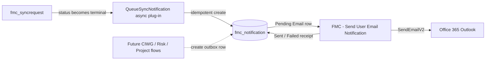

# Plan notification người dùng qua email

Trạng thái cập nhật: **đã implement và kiểm chứng live ngày 2026-09-16**
Phạm vi triển khai đầu tiên: thông báo kết quả SQL-to-Dataverse sync
Kênh được RMIT xác nhận: **Email**

## 1. Căn cứ yêu cầu

Hai tài liệu nguồn:

- [FM Requirement and Technical Solution](../reference/FM_Requirement_and_Techincal_Solution.pdf)
- [RMIT FDTAP - Summary](../reference/RMIT%20FDTAP%20-%20Summary.pdf)

Các yêu cầu liên quan trực tiếp:

| Nguồn | Yêu cầu | Áp dụng trong thiết kế |
| --- | --- | --- |
| FR-3.3 | Tự động thông báo khi submitted, approved, rejected, overdue, escalated | Dùng một notification outbox tái sử dụng theo `Event Type`; MVP tạo event cho sync terminal, các workflow FM nối vào sau |
| FR-3.4 | Nhắc trước hạn và escalation khi quá hạn | Chừa sẵn event type `Overdue` và `Escalated`; scheduler/escalation rule chưa triển khai vì chưa có bảng CIWG/risk/project |
| FR-3.5 | Giữ lịch sử trạng thái để audit | Mỗi lần gửi là một `fmc_notification`; lưu recipient, correlation key, flow run, attempt, Sent/Failed/Skipped và lỗi |
| FR-3.6 | Người dùng xem trạng thái request | Notification trỏ về `Regarding Table` + `Regarding ID`; MVP giữ receipt trong Dataverse, chưa thêm notification center vào app |
| FR-2.7, FR-4.6, FR-5.5 | Alert ngưỡng, checklist out-of-range, reminder đọc meter | Có thể dùng cùng outbox sau khi producer tương ứng được xây dựng |
| RMIT Summary Q4 | Chọn Teams hay email | RMIT trả lời “Via email notifications”; MVP không gửi Teams |
| RMIT Summary Q24 | Khoảng 30 người dùng | Power Automate + Office 365 Outlook phù hợp mức tải POC; chưa phải kiểm thử tải production |
| RMIT Summary Q27 | Manual email back-and-forth gây bottleneck | Receipt tập trung trong Dataverse thay cho gửi mail thủ công không truy vết |

## 2. Quyết định kiến trúc

Không gửi email trực tiếp từ plug-in. Plug-in chỉ tạo một outbox record; Power
Automate chịu trách nhiệm giao email và ghi receipt.



Lý do:

- Lỗi hoặc timeout email không rollback SQL sync.
- `fmc_correlationkey` alternate key ngăn một business event tạo nhiều outbox row.
- Producer không phụ thuộc connector email; sau này có thể thêm Teams/mobile mà
  không thay đổi transaction nghiệp vụ.
- Connection được đóng gói bằng solution connection reference, không lưu token
  OAuth trong Git.

## 3. Data contract

Table mới: `fmc_notification` (Standard, Organization-owned).

| Column | Ý nghĩa |
| --- | --- |
| `fmc_channel` | MVP chỉ có `Email` |
| `fmc_eventtype` | Sync succeeded/issues/failed và reserved event cho submitted/approved/rejected/overdue/escalated |
| `fmc_status` | `Pending`, `Sent`, `Failed`, `Skipped` |
| `fmc_recipientemail`, `fmc_recipientname` | Người nhận đã được producer resolve |
| `fmc_subject`, `fmc_body` | Nội dung email snapshot tại thời điểm tạo event |
| `fmc_correlationkey` | Khóa idempotency, ví dụ `syncrequest:<id>:status:<value>` |
| `fmc_regardingtable`, `fmc_regardingid` | Record nghiệp vụ nguồn |
| `fmc_attempts`, `fmc_attemptedat`, `fmc_sentat` | Delivery receipt |
| `fmc_flowrunid`, `fmc_errormessage` | Tra ngược Power Automate run và lỗi |

## 4. Luồng triển khai

1. `DataverseProvisioner` tạo table, columns, alternate key, default view và
   thêm quyền Create/Read/Write cho role `FM Central BMS Integration`.
2. Plug-in assembly `1.0.0.5` đăng ký async PostOperation Update step trên
   `fmc_syncrequest`, filtering attribute `fmc_status`.
3. Khi request sang `Succeeded`, `CompletedWithIssues` hoặc `Failed`, plug-in:
   - resolve email từ `fmc_requestedby`, GUID user hoặc `createdby`;
   - tạo nội dung email có delivered/quarantined/pending/error;
   - tạo đúng một `fmc_notification` theo correlation key;
   - tạo `Skipped` receipt nếu không resolve được email.
4. Flow `FMC - Send User Email Notification` trigger khi tạo Pending Email row,
   gọi Office 365 Outlook `SendEmailV2`, sau đó cập nhật `Sent` hoặc `Failed`.
5. Export/unpack solution `FMCentralBms` để giữ source flow/table/step trong Git.

## 5. Acceptance criteria

- Build solution không warning/error và unit test flow definition pass.
- Live metadata có table standard, đầy đủ columns và alternate key.
- Async plug-in step active đúng message/table/stage/mode/filter.
- Flow active, có đúng một callback Create cho `fmc_notification`.
- Smoke test tạo một Pending notification cho user hiện tại, nhận email và row
  chuyển sang `Sent` với `fmc_sentat`, `fmc_flowrunid`, `fmc_attempts = 1`.
- Test SQL sync tạo đúng một outbox row khi request hoàn tất; email failure không
  đổi trạng thái hoàn tất của `fmc_syncrequest`.

## 6. Giới hạn và phase tiếp theo

- MVP chứng minh notification bằng SQL sync hiện có. Repo chưa có table và state
  machine cho CIWG/risk/project nên chưa thể trung thực triển khai approval,
  reminder và escalation đầy đủ của FR-3.3/FR-3.4.
- `SendEmailV2` không trả message ID. Receipt `Sent` chứng minh connector action
  thành công, không phải bằng chứng người nhận đã đọc mail.
- Retry connector được tắt để giảm nguy cơ gửi trùng khi response bị mất. Record
  `Failed` được giữ để operator kiểm tra và requeue có chủ đích ở phase sau.
- Full Sync hiện dispatch SQL/SPO bằng flow owner; notification MVP phản ánh SQL
  request owner. Nếu cần mọi người bấm Full Sync đều nhận riêng, phase sau thêm
  subscriber table thay vì ghi đè một recipient trên request được coalesce.

## 7. Artifact triển khai

- `DataverseSyncWorker/Services/DataverseProvisioner.cs`
- `DataverseSyncWorker/Services/DataversePluginProvisioner.cs`
- `plugins/FMCentralBms.Plugins/QueueSyncNotification.cs`
- `scripts/provision-user-notification-flow.py`
- `scripts/tests/test_user_notification_flow.py`
- [Runbook vận hành và test](../runbooks/user-email-notifications.vi.md)

## 8. Receipt triển khai Developer

Target đã được kiểm tra trước khi mutation:

```text
Organization: ab191700-b99e-f111-aaa0-000d3a80bb96
Environment:  5abcb0e5-99b2-e51f-aa0e-90d84405798b
Solution:     FMCentralBms
```

Artifact live:

- table standard `fmc_notification`, alternate key
  `fmc_notification_correlationkey`;
- plug-in assembly `FMCentralBms.Plugins` version `1.0.0.5`;
- async step `926528c5-73b1-f111-aaad-00224819a344`;
- flow `FMC - Send User Email Notification`, ID
  `23cc5a60-0e28-4afd-8226-042dfeab84d4`, đang active;
- Office 365 Outlook connection reference `fmc_sharedoffice365outlook`.

Hai smoke test đã đạt `Sent`, `attempts = 1`:

1. Direct outbox: notification `17c4dba4-550c-4094-bbd2-197733ded85b`.
2. Full producer chain: Sync Request `e35482c8-68c8-4ab5-81c2-992c9e4babd1`
   tạo notification `1e061ef0-74b1-f111-aaac-70a8a500c355`.

Đây là receipt của lần chạy nêu trên, không thay thế lệnh `verify` khi kiểm tra
trạng thái hiện tại.
