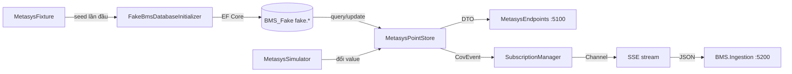

# BMS Fake — database, cách sử dụng và bố trí code

`BMS.Fake.App` là simulator của một nguồn Johnson Controls Metasys. Service chạy
ở port `5100`, đọc/ghi current state trong database riêng `BMS_Fake`, cung cấp
catalog BMS và phát COV event qua Server-Sent Events (SSE).

## 1. Kiến trúc tổng quát

`BMS.Fake` không dùng database `FM_Central` của `BMS.Ingestion`. Nó có database
riêng để mô phỏng một source thực tế có current state bền vững.



Luồng dữ liệu:

```text
MetasysFixture
  → FakeBmsDatabaseInitializer
  → FakeBmsDbContext / EF Core
  → BMS_Fake
  → MetasysPointStore
  → MetasysSimulator
  → SubscriptionManager
  → SSE
```

## 2. Database và EF Core

Database mặc định:

```text
Server: (local)
Database: BMS_Fake
Schema: fake
```

Các bảng:

| Entity | Table | Mục đích |
| --- | --- | --- |
| `FakeBuildingEntity` | `fake.bms_building` | Catalog building |
| `FakeEquipmentEntity` | `fake.bms_equipment` | Catalog equipment và foreign key building |
| `FakePointEntity` | `fake.bms_point` | Current state của point |

File mapping:

- [FakeBmsDbContext.cs](../../BMS.Fake/BMS.Fake.DataAccess/Persistence/FakeBmsDbContext.cs)
- [FakeBmsDatabaseInitializer.cs](../../BMS.Fake/BMS.Fake.DataAccess/Persistence/FakeBmsDatabaseInitializer.cs)

### Entity

Entity là class map với table database:

```csharp
internal sealed class FakePointEntity
{
    public string ObjectId { get; set; } = "";
    public decimal Value { get; set; }
    public DateTime Timestamp { get; set; }
}
```

`FakePointEntity` không được trả trực tiếp ra API. API nhận `MetasysPointDto`.

### DbContext

`FakeBmsDbContext` là session EF Core làm việc với database:

```csharp
internal DbSet<FakePointEntity> Points => Set<FakePointEntity>();
```

Mapping trong `OnModelCreating` chỉ rõ:

```text
FakePointEntity → fake.bms_point
ObjectId        → primary key
Value           → decimal(18,4)
Timestamp       → datetime2
```

### Khởi tạo và seed

Khi app bắt đầu:

1. `Program.cs` gọi `InitializeFakeDatabaseAsync`.
2. `FakeBmsDatabaseInitializer` gọi `EnsureCreatedAsync`.
3. Nếu `fake.bms_point` đã có dữ liệu thì không seed lại.
4. Nếu database trống, fixture được chuyển thành entity.
5. `SaveChangesAsync` ghi building, equipment và point vào `BMS_Fake`.

POC local dùng `EnsureCreatedAsync` để tự tạo database. Production nên dùng
EF Core migrations để version hóa schema.

## 3. Cấu hình

File:

[appsettings.json](../../BMS.Fake/BMS.Fake.App/appsettings.json)

```json
{
  "Urls": "http://localhost:5100",
  "Simulator": {
    "IntervalSeconds": 3
  },
  "Database": {
    "ConnectionString": "Data Source=(local);Initial Catalog=BMS_Fake;Integrated Security=True;Persist Security Info=False;Pooling=False;MultipleActiveResultSets=False;Connect Timeout=30;Encrypt=False;TrustServerCertificate=True;Packet Size=4096;Command Timeout=0;"
  }
}
```

- `Simulator:IntervalSeconds`: khoảng thời gian giữa các tick simulator.
- `Database:ConnectionString`: connection string tới database riêng của Fake.
- Không dùng `FM_Central` cho BMS Fake.
- Không commit password, token hoặc secret thật vào source.

## 4. Chạy service

Nếu dùng Windows Authentication và SQL Server local, database có thể được tạo
tự động bởi initializer:

```powershell
dotnet run --project .\BMS.Fake\BMS.Fake.App\BMS.Fake.App.csproj
```

Service mặc định chạy tại:

- Swagger: `http://localhost:5100/swagger`
- Root redirect: `http://localhost:5100/`

Nếu SQL Server không chạy hoặc connection string sai, app sẽ fail ngay lúc
startup. Đây là chủ ý để lỗi database không bị che giấu.

### Nếu không thấy database hoặc table trong SSMS

Build không tạo database. `BMS_Fake` chỉ được tạo khi `BMS.Fake.App` khởi động
thành công và chạy `EnsureCreatedAsync`.

Nếu app báo `Cannot generate SSPI context`, giá trị `Server` trong connection
string chưa phù hợp với SQL Server instance đang mở trong SSMS. Hãy copy chính
xác `Server name` ở màn hình Connect to Server của SSMS rồi cập nhật:

```json
{
  "Database": {
    "ConnectionString": "Server=<SSMS server name>;Database=BMS_Fake;Trusted_Connection=True;Encrypt=False;TrustServerCertificate=True;"
  }
}
```

`Encrypt=False` chỉ dành cho SQL Server local development khi máy chưa có
certificate TLS phù hợp. Môi trường production nên dùng encryption và
certificate hợp lệ.

Sau đó chạy lại app và kiểm tra bằng query:

```sql
SELECT TABLE_SCHEMA, TABLE_NAME
FROM BMS_Fake.INFORMATION_SCHEMA.TABLES
ORDER BY TABLE_SCHEMA, TABLE_NAME;
```

## 5. API endpoints

| Method | Endpoint | Ý nghĩa |
| --- | --- | --- |
| `GET` | `/api/metasys/objects` | Đọc snapshot tất cả point từ database |
| `GET` | `/api/metasys/objects/{objectId}` | Đọc một point |
| `GET` | `/api/metasys/buildings` | Đọc catalog building |
| `GET` | `/api/metasys/equipment` | Đọc catalog equipment |
| `POST` | `/api/metasys/subscriptions` | Tạo COV subscription |
| `GET` | `/api/metasys/subscriptions/{subscriptionId}/stream` | Mở SSE stream |

Tạo subscription:

```powershell
$body = @{ objectIds = @('WATER-001', 'TEMP-001') } | ConvertTo-Json
Invoke-RestMethod `
  -Method Post `
  -Uri http://localhost:5100/api/metasys/subscriptions `
  -ContentType 'application/json' `
  -Body $body
```

Response:

```json
{
  "subscriptionId": "SUB-001"
}
```

Mỗi SSE event có dạng:

```text
event: cov
data: {"objectId":"TEMP-001","currentValue":24.7,...}
```

## 6. Bố trí code

```text
BMS.Fake/
  BMS.Fake.App/
    Program.cs                         # Host và database initialization
    Endpoints/MetasysEndpoints.cs      # REST + SSE presentation
    Hosting/ServiceCollectionExtensions.cs

  BMS.Fake.Business/
    Abstractions/                      # Interface cho business
      IMetasysPointStore.cs
      ISubscriptionManager.cs
    Contracts/FakeMetasysDtos.cs       # DTO API/state
    Models/MetasysSubscription.cs      # Runtime Channel subscription
    Services/MetasysSimulator.cs      # Background use case

  BMS.Fake.Common/
    Configuration/
      FakeDatabaseOptions.cs
      SimulatorOptions.cs

  BMS.Fake.Domain/
    Rules/CovDeltaPolicy.cs            # Pure business rule

  BMS.Fake.DataAccess/
    Hosting/ServiceCollectionExtensions.cs
    Persistence/
      FakeBmsDbContext.cs               # DbContext, entities, mapping
      FakeBmsDatabaseInitializer.cs     # EnsureCreated + seed
    Simulation/MetasysFixture.cs        # Seed data
    Services/MetasysPointStore.cs       # EF Core query/update
    Services/SubscriptionManager.cs     # In-memory subscription channels
```

## 7. Đọc code theo thứ tự

1. [Program.cs](../../BMS.Fake/BMS.Fake.App/Program.cs)
2. [AddMetasysServices](../../BMS.Fake/BMS.Fake.App/Hosting/ServiceCollectionExtensions.cs)
3. [AddFakeDataAccess](../../BMS.Fake/BMS.Fake.DataAccess/Hosting/ServiceCollectionExtensions.cs)
4. [FakeBmsDatabaseInitializer](../../BMS.Fake/BMS.Fake.DataAccess/Persistence/FakeBmsDatabaseInitializer.cs)
5. [FakeBmsDbContext](../../BMS.Fake/BMS.Fake.DataAccess/Persistence/FakeBmsDbContext.cs)
6. [MetasysPointStore](../../BMS.Fake/BMS.Fake.DataAccess/Services/MetasysPointStore.cs)
7. [MetasysSimulator](../../BMS.Fake/BMS.Fake.Business/Services/MetasysSimulator.cs)
8. [MetasysEndpoints](../../BMS.Fake/BMS.Fake.App/Endpoints/MetasysEndpoints.cs)

## 8. Runtime flow

### API đọc point

```text
GET /api/metasys/objects/WATER-001
  → MetasysEndpoints
  → IMetasysPointStore.GetAsync
  → MetasysPointStore tạo DbContext
  → AsNoTracking query fake.bms_point
  → project FakePointEntity thành MetasysPointDto
  → HTTP 200 JSON
```

`AsNoTracking()` dùng cho query read-only. DTO giúp entity database không lộ ra
presentation layer.

### Simulator cập nhật point

```text
PeriodicTimer
  → IMetasysPointStore.GetAllAsync
  → CovDeltaPolicy.Calculate
  → IMetasysPointStore.ChangeValueAsync
  → EF UPDATE fake.bms_point
  → tạo CovEvent
  → SubscriptionManager.Publish
  → SSE client nhận JSON
```

`ChangeValueAsync` đọc previous value và update current value trong cùng database
transaction. Vì vậy COV event có `PreviousValue` chính xác.

### Subscription

Subscription không cần lưu database vì đây là connection runtime:

- `ConcurrentDictionary` giữ các subscription đang mở.
- `Channel<CovEvent>` truyền event từ simulator tới SSE endpoint.
- Khi process restart, subscription cũ mất và client phải subscribe lại.

## 9. DTO, entity và shared contract

```text
FakePointEntity
  = database model, chỉ dùng trong DataAccess

MetasysPointDto
  = API DTO, dùng để trả current point state

CovEvent
  = shared contract giữa BMS.Fake và BMS.Ingestion qua SSE
```

`CovEvent` vẫn nằm trong `BMS.Ingestion.Domain` vì hai service phải thống nhất
JSON contract. Không đổi tên `ObjectId`, `PreviousValue`, `CurrentValue`, `Unit`
hoặc `Timestamp` nếu chưa thiết kế contract migration.

## 10. Cách mở rộng

### Thêm dữ liệu seed

Sửa [MetasysFixture.cs](../../BMS.Fake/BMS.Fake.DataAccess/Simulation/MetasysFixture.cs).
Fixture chỉ dùng khi database chưa có point; nó không ghi đè current state ở mỗi
lần restart.

### Thêm cột database

1. Thêm property vào entity.
2. Thêm mapping trong `FakeBmsDbContext`.
3. Cập nhật seed nếu cần.
4. Cập nhật DTO và projection.
5. Production: tạo EF migration và apply migration.

### Thay database implementation

Implement `IMetasysPointStore` mới rồi đổi registration trong
`AddFakeDataAccess`. `MetasysSimulator` và endpoint chỉ phụ thuộc interface.

## 11. Nguyên tắc cần nhớ

- `BMS.Fake` là simulator, không chứng minh kết nối Johnson Controls Metasys thật.
- `BMS_Fake` là database riêng cho current state của Fake.
- `FM_Central` vẫn là SQL system of record của `BMS.Ingestion`.
- `MetasysFixture` chỉ là seed data, không phải runtime data source.
- Dùng `AsNoTracking` cho read-only query.
- Dùng `SaveChangesAsync` và transaction cho update state.
- Production nên dùng EF Core migrations thay cho `EnsureCreatedAsync`.
