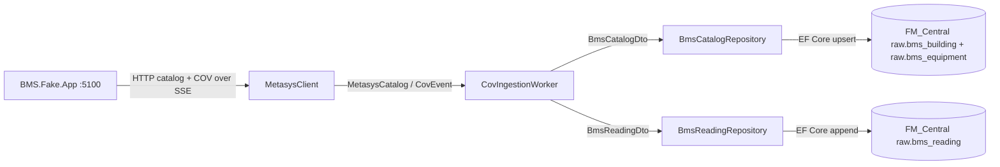

# BMS Ingestion — hướng dẫn sử dụng và bố trí code

Tài liệu này dành cho người mới làm quen với `BMS.Ingestion`. Nội dung giải thích
cách chạy service, luồng dữ liệu và vai trò của từng project/file trong phần BMS
ingestion.

## 1. BMS Ingestion làm nhiệm vụ gì?

`BMS.Ingestion` là service nhận dữ liệu từ `BMS.Fake.App` hoặc một adapter
Metasys tương thích, sau đó:

1. Đọc catalog gồm `Building`, `Equipment` và `Point`.
2. Lưu catalog vào SQL Server nếu SQL persistence được bật.
3. Tạo subscription cho các point.
4. Đọc COV event qua SSE.
5. Append từng reading vào `raw.bms_reading`.
6. Cung cấp endpoint để xem trạng thái và các event gần đây.

Service này không gửi dữ liệu trực tiếp vào Dataverse. `Dataverse.SyncWorker`
đọc SQL system of record ở một pipeline riêng.



## 2. Chuẩn bị trước khi chạy

Yêu cầu:

- .NET 10 SDK.
- SQL Server local hoặc SQL Server có thể truy cập từ máy chạy service.
- Database `FM_Central` và các bảng `raw.*` đã được tạo nếu muốn bật SQL.

Tạo schema SQL bằng script:

```powershell
sqlcmd -S localhost -E -C -i .\sql\create-bms-tables.sql
```

Nếu máy không có `sqlcmd`, có thể mở `sql/create-bms-tables.sql` trong SQL Server
Management Studio hoặc Azure Data Studio rồi chạy script.

## 3. Cách chạy local

### Bước 1 — chạy Fake Metasys

Mở terminal thứ nhất tại root repository:

```powershell
dotnet run --project .\BMS.Fake\BMS.Fake.App\BMS.Fake.App.csproj
```

Fake service mặc định chạy tại:

- Swagger: `http://localhost:5100/swagger`
- Catalog objects: `GET http://localhost:5100/api/metasys/objects`
- Catalog buildings: `GET http://localhost:5100/api/metasys/buildings`
- Catalog equipment: `GET http://localhost:5100/api/metasys/equipment`
- COV subscription: `POST http://localhost:5100/api/metasys/subscriptions`

### Bước 2 — chạy BMS Ingestion

Mở terminal thứ hai:

```powershell
dotnet run --project .\BMS.Ingestion\BMS.Ingestion.App\BMS.Ingestion.App.csproj
```

Service mặc định chạy tại `http://localhost:5200`.

Khi service khởi động, `CovIngestionWorker` tự động:

1. gọi catalog endpoints của Fake Metasys;
2. upsert catalog vào SQL nếu SQL đang bật;
3. subscribe toàn bộ point;
4. đọc SSE stream;
5. ghi event thay đổi vào `raw.bms_reading`.

Mở `http://localhost:5200/swagger` để xem API.

### Chạy không cần SQL

Để chỉ kiểm tra HTTP/SSE và không ghi SQL:

```powershell
dotnet run --project .\BMS.Ingestion\BMS.Ingestion.App\BMS.Ingestion.App.csproj -- --no-sql
```

Trong mode `--no-sql`, worker vẫn đọc catalog, subscribe và nhận event; chỉ các
lệnh persistence bị bỏ qua.

## 4. Endpoint của BMS Ingestion

| Method | Endpoint | Ý nghĩa |
| --- | --- | --- |
| `GET` | `/` | Redirect tới Swagger UI |
| `GET` | `/swagger` | Mở Swagger UI |
| `GET` | `/api/ingestion/status` | Trạng thái worker, SQL, subscription và số lượng event |
| `GET` | `/api/ingestion/events/recent` | Tối đa 25 COV event gần nhất trong memory |

Ví dụ đọc status:

```powershell
Invoke-RestMethod http://localhost:5200/api/ingestion/status
```

Ví dụ đọc event gần đây:

```powershell
Invoke-RestMethod http://localhost:5200/api/ingestion/events/recent
```

`/api/ingestion/events/recent` chỉ là bộ nhớ runtime. Restart service sẽ xóa
danh sách này; lịch sử đầy đủ nằm trong SQL `raw.bms_reading`.

## 5. Cấu hình

File mặc định là [appsettings.json](../../BMS.Ingestion/BMS.Ingestion.App/appsettings.json):

```json
{
  "Urls": "http://localhost:5200",
  "Metasys": {
    "BaseUrl": "http://localhost:5100/"
  },
  "Sql": {
    "Enabled": true,
    "ConnectionString": "Server=localhost;Database=FM_Central;Trusted_Connection=True;TrustServerCertificate=True;"
  }
}
```

Ý nghĩa các trường:

- `Urls`: giá trị cấu hình chung; app hiện cố định HTTP URL trong `Program.cs` là
  `http://localhost:5200`.
- `Metasys.BaseUrl`: URL của source adapter, mặc định là Fake Metasys.
- `Sql.Enabled`: bật/tắt SQL persistence mặc định.
- `Sql.ConnectionString`: connection string tới SQL Server.
- `--no-sql`: runtime flag có quyền tắt SQL cho một lần chạy, kể cả khi
  `Sql.Enabled` là `true`.

Không commit token, password hoặc secret thật vào `appsettings.json`.

## 6. Bố trí code

```text
BMS.Ingestion/
  BMS.Ingestion.App/                    # Composition root, HTTP endpoints, host
    Program.cs
    Endpoints/IngestionEndpoints.cs
    Hosting/ServiceCollectionExtensions.cs

  BMS.Ingestion.Business/               # Use case và contract nội bộ
    Abstractions/                        # Interface mà service phụ thuộc
      IMetasysClient.cs
      IBmsCatalogRepository.cs
      IBmsReadingRepository.cs
    Contracts/                           # DTO đi qua ranh giới persistence
      BmsPersistenceDtos.cs
    Mapping/                             # Chuyển domain model thành DTO
      BmsPersistenceDtoMapper.cs
    Services/
      CovIngestionWorker.cs              # Use case chính
      IngestionStatusTracker.cs          # Runtime status
    Models/
      IngestionStatus.cs                 # Status response model

  BMS.Ingestion.Common/                 # Configuration dùng chung
    Configuration/AppSettings.cs

  BMS.Ingestion.Domain/                 # Model nghiệp vụ/source model
    Models/BmsCatalog.cs
    Models/CovEvent.cs

  BMS.Ingestion.DataAccess/              # Adapter HTTP và SQL/EF Core
    Hosting/ServiceCollectionExtensions.cs
    Persistence/
      BmsEntities.cs                     # EF entities, chỉ thuộc DataAccess
      BmsIngestionDbContext.cs           # Mapping entity -> raw.*
    Services/
      MetasysClient.cs                   # HTTP/JSON/SSE adapter
      BmsCatalogRepository.cs            # Upsert building/equipment
      BmsReadingRepository.cs            # Append raw reading
```

### 6.1 `BMS.Ingestion.App`

Đây là nơi khởi động ứng dụng.

- `Program.cs` tạo `WebApplication`, đọc `--no-sql`, load settings và gọi DI.
- `Hosting/ServiceCollectionExtensions.cs` nối interface với implementation.
- `Endpoints/IngestionEndpoints.cs` chỉ map HTTP endpoint; không chứa logic
  đọc SSE hoặc SQL.

Khi muốn đổi cách đăng ký service, bắt đầu đọc từ `Program.cs`, sau đó đi vào
`AddIngestionServices`.

### 6.2 `BMS.Ingestion.Business`

Đây là nơi chứa use case, interface và DTO mà business layer hiểu.

`CovIngestionWorker` không tạo trực tiếp `HttpClient`, `DbContext` hoặc SQL
command. Nó chỉ gọi interface:

```csharp
IMetasysClient
IBmsCatalogRepository
IBmsReadingRepository
```

Lợi ích của cách này:

- dễ thay Fake Metasys bằng adapter thật;
- dễ dùng fake repository khi kiểm tra worker;
- business layer không bị khóa vào EF Core;
- SQL entity không lan sang các layer khác.

### 6.3 DTO và Mapper

Các DTO trong `Business/Contracts` là dữ liệu mà repository cần:

- `BmsCatalogDto`: một snapshot gồm buildings và equipment;
- `BmsReadingDto`: một reading cần append;
- `BmsBuildingDto`, `BmsEquipmentDto`: các item trong catalog.

`BmsPersistenceDtoMapper` chuyển:

```text
MetasysCatalog -> BmsCatalogDto
CovEvent       -> BmsReadingDto
```

`PreviousValue` của `CovEvent` không được đưa vào `BmsReadingDto` vì
`raw.bms_reading` chỉ lưu giá trị reading hiện tại.

### 6.4 `BMS.Ingestion.DataAccess`

Đây là infrastructure layer. Nó biết chi tiết HTTP, JSON, SSE, EF Core và SQL.

- `MetasysClient` gọi source API và biến SSE JSON thành `CovEvent`.
- `BmsIngestionDbContext` khai báo mapping tới schema `raw`.
- `BmsEntities` chứa class chỉ dành cho EF; không dùng ở Business layer.
- `BmsCatalogRepository.StageAsync` chuẩn bị upsert catalog trong change tracker.
- `BmsReadingRepository.Add` chuẩn bị append reading và để SQL Server sinh `id`.

`IBmsIngestionUnitOfWorkFactory` là singleton được inject vào worker. Mỗi catalog
snapshot hoặc COV event tạo một DI scope ngắn hạn, trong đó Unit of Work và hai
repository dùng chung một pooled `BmsIngestionDbContext`. `CommitAsync` gọi
`SaveChangesAsync` một lần; SQL Server transaction bao phủ toàn bộ thay đổi,
EF sắp xếp building/equipment theo foreign key. Dispose scope giải phóng context;
thay đổi chưa commit bị bỏ. Chỉ cập nhật status thành công sau commit.
Không giữ Unit of Work qua vòng đời SSE stream; không dùng đồng thời trên nhiều thread.

### 6.5 EF Core mapping

Mapping nằm trong [BmsIngestionDbContext.cs](../../BMS.Ingestion/BMS.Ingestion.DataAccess/Persistence/BmsIngestionDbContext.cs):

| EF entity | SQL table | Khóa |
| --- | --- | --- |
| `BmsBuildingEntity` | `raw.bms_building` | `building_code` |
| `BmsEquipmentEntity` | `raw.bms_equipment` | `equipment_code` |
| `BmsReadingEntity` | `raw.bms_reading` | `id` identity |

Schema database vẫn được quản lý bởi [create-bms-tables.sql](../../sql/create-bms-tables.sql).
EF Core ở đây dùng mapping/runtime persistence; không tự tạo migration hoặc tự
thay đổi schema.

## 7. Luồng xử lý chi tiết

### Khi service bắt đầu

```text
Program
  -> AppSettings.Load
  -> AddIngestionServices
  -> AddBmsIngestionDataAccess
  -> CovIngestionWorker.ExecuteAsync
```

### Khi đọc catalog

```text
MetasysClient.ReadCatalogAsync
  -> GET buildings
  -> GET equipment
  -> GET objects
  -> MetasysCatalog
  -> BmsPersistenceDtoMapper.ToPersistenceDto
  -> BmsCatalogRepository.StageAsync
  -> UnitOfWork.CommitAsync
```

Catalog validation kiểm tra:

- không có duplicate `BuildingCode`;
- không có duplicate `EquipmentCode`;
- mọi `Equipment.BuildingCode` đều có trong catalog building.

### Khi nhận COV event

```text
MetasysClient.ReadEventsAsync
  -> đọc từng dòng SSE data:
  -> deserialize thành CovEvent
  -> worker cập nhật status
  -> mapper tạo BmsReadingDto
  -> BmsReadingRepository.Add
  -> UnitOfWork.CommitAsync
  -> EF Core SaveChangesAsync
  -> SQL INSERT raw.bms_reading
```

Nếu `SaveChangesAsync` lỗi, worker không tăng `RowsInserted` và status chuyển
sang `Failed`. Code không âm thầm bỏ qua lỗi persistence.

## 8. Cách mở rộng an toàn

### Thêm source Metasys thật

1. Tạo class mới trong `DataAccess/Services`, ví dụ `RealMetasysClient`.
2. Implement `IMetasysClient`.
3. Giữ output là `MetasysCatalog` và `CovEvent` để worker không phải biết chi tiết
   transport mới.
4. Đổi registration trong `AddIngestionServices`.
5. Đặt authentication/secret trong configuration hoặc secret store; không hard-code.

### Thêm cột SQL

1. Cập nhật SQL schema script trước.
2. Cập nhật EF entity trong `Persistence/BmsEntities.cs`.
3. Cập nhật mapping trong `BmsIngestionDbContext.cs`.
4. Cập nhật DTO/mapper nếu business cần giá trị mới.
5. Cập nhật repository và các query liên quan.
6. Xác nhận không làm thay đổi identity, timestamp conversion hoặc precision
   hiện có.

### Thêm loại persistence khác

Tạo interface mới trong `Business/Abstractions`, DTO trong `Business/Contracts`,
implementation trong `DataAccess/Services`, rồi đăng ký implementation trong
`DataAccess/Hosting/ServiceCollectionExtensions.cs`. Không đưa EF entity vào
Business layer.

## 9. Một số lỗi thường gặp

### `Connection refused` tới port 5100

`BMS.Fake.App` chưa chạy hoặc `Metasys.BaseUrl` sai. Kiểm tra:

```powershell
Invoke-WebRequest http://localhost:5100/swagger
```

### SQL connection lỗi

Kiểm tra SQL Server đang chạy, database `FM_Central` tồn tại và
`Sql.ConnectionString` đúng. Nếu chỉ muốn kiểm tra SSE, dùng `--no-sql`.

### Catalog lỗi foreign key

Kiểm tra `Equipment.BuildingCode` có khớp `Building.BuildingCode` hay không.
Repository cố ý validate trước khi ghi để lỗi dễ hiểu hơn.

### Swagger không mở

Mở trực tiếp `http://localhost:5200/swagger`. Nếu port đang bị chiếm, kiểm tra
process đang dùng port 5200 và cấu hình host tương ứng trước khi chạy lại.

## 10. Nguyên tắc cần nhớ

- `Business` chỉ phụ thuộc abstraction và DTO, không phụ thuộc EF entity.
- `DataAccess` là nơi duy nhất biết HTTP/SSE/EF Core/SQL.
- `raw.bms_reading` là append-only history; không update reading cũ trong ingestion.
- Catalog được upsert trong transaction; building được lưu trước equipment.
- Giữ nguyên `ObjectId`, `BuildingCode`, `EquipmentCode`, SQL identity và
  `decimal(18,4)`.
- SQL schema là contract hiện hữu; thay đổi schema phải cập nhật script và mapping
  có chủ đích.
