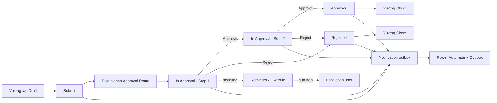

# Epic 3 — FM Request: hướng dẫn chuẩn bị, test và demo

Tài liệu này là “script” để chuẩn bị và trình bày Epic 3 trong **FMC BMS Demo**.
Epic 3 minh họa một quy trình FM Request có phê duyệt nhiều bước, email, nhắc hạn,
escalation, audit history và risk view trên Dataverse.

> Môi trường demo: Developer `org06cbc9ec`  
> Solution: `FMCentralBms`  
> App: [FMC BMS Demo](https://org06cbc9ec.crm5.dynamics.com/main.aspx?appid=d19f4897-d227-4df3-8361-988f97c53e89)

## Kịch bản người thật dùng trong buổi demo

Để người nghe dễ hình dung, dùng hai vai sau thay cho các tên kỹ thuật:

| Người | Vai trò trong câu chuyện | Vai trò trong Dataverse |
|---|---|---|
| **Vương** | Nhân viên phát hiện vấn đề tại tòa nhà và tạo yêu cầu | Request owner/requester |
| **Phương** | Sếp xem xét chi phí, rủi ro và quyết định phê duyệt | Approver trong `Approval Route` |

Trong demo, Vương đăng nhập bằng tài khoản của mình (`vuong.nguyenq@titancorpvn.com`).
Phương cần là một active Dataverse user có email thật và được cấu hình vào trường
`Approver Email` của route. Không nên ghi cứng email của Phương vào code.

### Câu chuyện nghiệp vụ

> Sáng thứ Hai, Vương phát hiện AHU tại Building A hoạt động không ổn định. Vương
> tạo một FM Request để đề nghị kiểm tra và thay thế linh kiện. Vì request có chi phí
> dự kiến 10.000, Vương gửi cho Phương phê duyệt. Phương nhận email, mở request,
> xem mô tả, chi phí và risk information rồi quyết định Approve hoặc Reject. Nếu
> được duyệt, Vương đóng request sau khi công việc hoàn tất.

Đây là câu chuyện chính dùng xuyên suốt các bước dưới đây.

## 1. Epic 3 đã làm những gì?

Epic 3 biến bảng `fmc_fmrequest` từ một bảng CRUD thành một workflow có kiểm soát:

| Nhóm | Kết quả đã implement | Vì sao cần |
|---|---|---|
| Request lifecycle | `Draft → In Approval → Approved/Rejected → Closed` | Không cho đổi trạng thái tùy ý bằng form/import/API |
| Approval route | Route theo Request Type, Department, Estimated Value và Risk Severity | Mỗi loại request có đúng người duyệt và đúng thứ tự |
| Multi-step approval | Hỗ trợ nhiều step, demo đang cấu hình 2 step | Chứng minh request chưa được Approved khi mới duyệt một phần |
| Custom API | `fmc_TransitionFmRequest`, `fmc_ProcessFmRequestDeadline` | Đưa business rule vào server, dùng chung cho mọi client |
| Plugin guard | Chặn sửa/xóa sai lifecycle, kiểm tra owner, role, active user | Bảo vệ dữ liệu kể cả khi người dùng gọi API trực tiếp |
| Immutable history | Ghi actor, email, command, step, comment, revision, UTC time | Có audit trail để giải thích request đã đi qua ai và lúc nào |
| Email notification | Ghi outbox `fmc_notification`, Power Automate gửi Outlook | Tách transaction nghiệp vụ khỏi việc gửi email; có trạng thái Pending/Sent/Failed |
| Deadline automation | Flow chạy mỗi 5 phút gọi Deadline API | Tạo Reminder, Overdue và Escalation mà không cần người dùng mở app |
| Risk view | Risk fields và heat-map Likelihood × Impact | Cho người quản lý nhìn nhanh các request có rủi ro cao |
| Concurrency/idempotency | `ExpectedRevision`, Dataverse row version và `OperationId` | Ngăn hai người cùng approve hoặc retry tạo history/email trùng |

Epic 3 tương ứng các nhóm acceptance chính FR-3.1 đến FR-3.7 trong tài liệu requirement:

- **FR-3.1:** tạo/sửa Draft, submit, approve, reject và close.
- **FR-3.2:** route hai bước và kiểm tra role của approver.
- **FR-3.3:** email receipt cho các event workflow.
- **FR-3.4:** reminder/escalation, mỗi event chỉ tạo một lần.
- **FR-3.5:** lịch sử append-only có actor, timestamp và comment.
- **FR-3.6:** action được xác thực ở server và danh sách theo phạm vi.
- **FR-3.7:** trường risk và risk heat-map.

## 2. Full flow cần nói khi demo



### Diễn giải theo từng bước

1. **Vương tạo Draft:** request được lưu vào `fmc_fmrequest`. Lúc này Vương được
   chỉnh các trường nghiệp vụ và có thể sửa/xóa Draft.
2. **Submit:** UI gọi `fmc_TransitionFmRequest` với `Action=Submit`,
   `ExpectedRevision` và một `OperationId` mới.
3. **Plugin validate:** kiểm tra owner, trạng thái Draft, trường bắt buộc,
   route phù hợp, approver active, role và SLA. Route được snapshot vào request.
4. **Giao step:** request chuyển sang `In Approval`, ghi approver/current step/due
   date và tạo history + notification outbox trong cùng transaction.
5. **Phương quyết định:** chỉ approver hiện tại có role hợp lệ mới được Approve
   hoặc Reject; Approve step cuối chuyển sang Approved, Reject chuyển Rejected.
6. **Deadline flow:** flow mỗi 5 phút tìm request còn In Approval và gọi Deadline
   API. Plugin quyết định có cần Reminder, Overdue hay Escalation hay không.
7. **Vương đóng request:** Vương nhập closure comment và gọi Close. Request kết thúc
   ở Closed; history không được sửa/xóa.
8. **Email:** flow `FMC - Send User Email Notification` lấy notification Pending,
   gửi HTML email qua Outlook rồi đánh dấu Sent hoặc Failed.

## 3. Chuẩn bị trước buổi demo

### 3.1 Tài khoản và quyền

- Đăng nhập đúng Developer environment `org06cbc9ec`.
- Tài khoản demo phải là active Dataverse user có email.
- Approver và escalation user phải có role được cấu hình trong Approval Route.
- Nếu demo bằng cùng một tài khoản, giải thích rõ đây là **demo configuration**;
  production nên tách Owner, Approver và Automation identity.

### 3.2 Kiểm tra flow và plugin

Vào Power Automate và kiểm tra:

- `FMC - Send User Email Notification`: **On**.
- `FMC - Process FM Request Deadlines`: **On**, recurrence mỗi 5 phút.
- Connection reference Outlook còn đăng nhập và flow run gần nhất không Failed.

Kiểm tra trong solution:

- Plugin assembly `FMCentralBms.Plugins` version `1.0.0.13`.
- Environment variable `fmc_FmAppUrl` trỏ tới app HTTPS.
- Có Approval Route cho Department `EPIC3-DEMO`.

Nếu muốn demo đúng hai nhân vật Vương–Phương, tạo một route có **Step No = 1** và
đặt email Dataverse của Phương vào `Approver Email`. Nếu muốn trình bày approval
nhiều cấp, giữ thêm Step 2 với một người duyệt khác; không nên gán Phương vào cả
hai bước chỉ để làm cho demo chạy.

### 3.3 Chuẩn bị dữ liệu demo

Nên tạo request mới trong mỗi buổi demo, không sửa các request business thật.
Dùng Department `EPIC3-DEMO` để route demo không ảnh hưởng cấu hình khác.

| Kịch bản | Request Type | Dữ liệu gợi ý | Kết quả |
|---|---|---|---|
| Happy path | CIWG | `AHU replacement - Building A` | Submit → Approve step 1 → Approve step 2 → Close |
| Reject path | Risk | Likelihood 4, Impact 5, Mitigation có nội dung | Submit → Reject → Close |
| Deadline | Project | Giữ request ở In Approval | Flow tạo Reminder/Overdue theo SLA |
| Concurrency | CIWG | Hai tab cùng mở một request | Một action thành công, action cũ nhận HTTP 412 |

## 4. Kịch bản demo khuyến nghị (15–20 phút)

### Phần A — Mở đầu (1 phút)

Nói ngắn gọn:

> “Epic 3 bổ sung business workflow cho FM Request. Người dùng không đổi Status
> trực tiếp; họ thực hiện command. Dataverse plugin kiểm soát state transition,
> Power Automate xử lý email và deadline, còn request history là bằng chứng audit.”

Mở app và vào menu **FM Workflow**.

### Phần B — Vương tạo và Submit một CIWG request (3 phút)

1. Đăng nhập bằng tài khoản của **Vương**, vào **FM Requests → New**.
2. Nhập:
   - Name: `Vương - AHU Building A - <today>`
   - Department: `EPIC3-DEMO`
   - Request Type: `CIWG`
   - Description: mô tả ngắn yêu cầu bảo trì.
   - Estimated Value: `10000`.
3. Save và chỉ ra Status đang là **Draft**.
4. Mở **Workflow actions & history** hoặc **My Requests & Approvals**.
5. Bấm **Gửi phê duyệt** và nhập comment nếu UI yêu cầu.
6. Refresh; chỉ ra:
   - Status chuyển **In Approval**.
   - Current Step là `1`.
   - Approver và Due date đã được snapshot.
   - History có event Submit.

Điểm cần nói: Submit không chỉ là update một cột; server đã validate route của Phương
và ghi request/history/outbox trong transaction.

### Phần C — Phương duyệt và xem email (4 phút)

1. Chuyển sang browser profile/tài khoản của **Phương**, mở **Pending Approvals**.
2. Phương mở request, xem chi phí và mô tả, nhập comment rồi bấm **Duyệt bước này**.
3. Nếu route demo chỉ có một bước, request chuyển thẳng **Approved**. Nếu route
   đang cấu hình hai bước, chỉ ra request vẫn **In Approval** và đang chờ step 2.
4. Mở notification hoặc Power Automate run history để chỉ ra email Submit/Approve
   đã được gửi tới Phương và Vương.
5. Nếu có step 2, người duyệt thứ hai thực hiện quyết định cuối.
6. Chuyển lại tài khoản Vương, mở request đã Approved, nhập closure comment và bấm
   **Đóng request**.
7. Mở History, chỉ ra các dòng Submit, Approve và Close cùng actor tương ứng.

Khi trình chiếu email, tập trung vào status badge, current step/approver/due,
workflow note và nút **Open FM Request & review**.

### Phần D — Reject và Risk heat-map (3 phút)

1. Tạo request Type **Risk**.
2. Nhập Likelihood `4`, Impact `5`, Risk Severity, Mitigation và Review Date.
3. Submit request.
4. Phương nhập lý do và bấm **Từ chối**.
5. Vương mở lại request, xem comment của Phương rồi đóng request.
6. Mở **Risk register**, chỉ ra request nằm tại ô `4 × 5` trên heat-map.

Điểm cần nói: risk score là dữ liệu được khai báo; heat-map giúp nhìn nhanh,
không tự thay thế chính sách phân loại rủi ro của doanh nghiệp.

### Phần E — Deadline automation (3 phút)

Không cần chờ một ngày trong buổi demo. Có hai cách:

- **Demo cloud:** dùng request đã chuẩn bị với SLA/reminder phù hợp, chờ scheduled
  flow chạy mỗi 5 phút và mở Flow run history.
- **Demo kỹ thuật:** gọi Deadline API trong test/live smoke script để chứng minh
  Reminder, Overdue và Escalation; giải thích production sẽ để scheduler gọi API.

Khi event xảy ra, chỉ ra history mới, notification Pending rồi Sent, và approver
đổi sang escalation user nếu đã đến mốc escalation. Request vẫn In Approval;
automation không tự Approve/Reject.

### Phần F — Concurrency và idempotency (2 phút)

1. Mở cùng một request ở hai tab.
2. Hai tab cùng bấm Approve với revision cũ.
3. Một tab thành công; tab còn lại nhận **Request changed** hoặc HTTP 412.
4. Retry cùng `OperationId` của action thành công không tạo thêm history/email.

> Đây là phần để trả lời câu hỏi “nếu Vương mở hai tab và gửi hai lần thì sao?” — Dataverse
> row version và `ExpectedRevision` bảo vệ transaction.

## 5. Bộ test cần trình bày

| Test | Cách thực hiện | Kết quả mong đợi |
|---|---|---|
| Draft CRUD | Tạo, sửa, lưu và xóa Draft của owner | Thành công |
| Submit authorization | User không phải owner bấm Submit | Bị từ chối |
| Route selection | Đổi Request Type/Department/Value | Chọn đúng route hoặc báo ambiguous |
| Approver authorization | User không phải approver bấm Approve | Bị từ chối |
| Required comment | Approve/Reject/Close không nhập comment | Bị từ chối |
| Happy path | Submit → Approve 1 → Approve 2 → Close | Approved rồi Closed, history đầy đủ |
| Reject path | Submit → Reject → Close | Rejected rồi Closed |
| Reminder | Đến reminder window | Một reminder, không duplicate |
| Overdue | Qua due nhưng chưa escalation | Một Overdue event |
| Escalation | Qua due + escalation hours | Giao cho escalation user |
| Concurrency | Hai action cùng revision | Một success, một HTTP 412 |
| Idempotency | Retry cùng OperationId | Trả receipt cũ, không tạo bản ghi mới |
| Guard | Sửa Status/history sau Submit bằng form/API | Bị plugin chặn |
| Email | Xem `fmc_notification` và flow run | Pending → Sent hoặc Failed có lý do |
| Risk UI | Risk 4×5 mở Risk register | Hiển thị đúng ô heat-map |

## 6. Lệnh kiểm tra trước demo

Chạy từ `D:\metasys-poc`:

```powershell
dotnet build MetasysPoc.sln --no-restore -v:q
dotnet test tests/MetasysPoc.Tests --no-build -v:q
node --test scripts/tests/fm-workflow-ui.test.cjs
python -m unittest scripts/tests/test_fm_workflow_deployment.py
```

Kiểm tra live solution và resource:

```powershell
python scripts/provision-fm-workflow.py verify
```

Smoke test có tạo record demo và email về tài khoản demo đã cấu hình:

```powershell
python scripts/test-fm-workflow-live.py run --scenario approve
python scripts/test-fm-workflow-live.py run --scenario reject
python scripts/test-fm-workflow-live.py run --scenario scheduled
python scripts/test-fm-workflow-live.py receipts
```

Không chạy smoke test ngay trước buổi demo nếu không muốn tạo thêm request/email.
Các record test nên để lại làm evidence, hoặc đóng request sau khi kiểm tra.

## 7. Nơi kiểm tra khi có lỗi

| Hiện tượng | Kiểm tra |
|---|---|
| Không thấy nút action | Refresh app, mở đúng tab Workflow, kiểm tra status/owner/current user |
| Submit bị từ chối | Approval Route, Department, Request Type, owner và required fields |
| Approve bị từ chối | Approver hiện tại, active user, role và revision |
| Email không đến | `fmc_notification`, `fmc_flowrunid`, flow run history và Outlook connection |
| Reminder không chạy | Flow deadline có On không, recurrence 5 phút, due time là UTC |
| Request changed | Refresh record rồi thao tác lại; không dùng revision cũ |
| UI cũ sau deploy | Refresh hard/reopen app; kiểm tra webresource đã publish |
| Plugin không vào breakpoint local | Plugin chạy trên Dataverse sandbox; xem Plugin Trace Log thay vì debug worker local |

## 8. Câu hỏi thường gặp khi báo cáo

**Tại sao không cho sửa Status trực tiếp trên model-driven form?**  
Vì Status là kết quả của business command. Nếu cho sửa trực tiếp, người dùng có
thể bỏ qua approver, comment, role check, history và email. Plugin guard bảo vệ cả
form, API và import.

**Tại sao cần Custom API nếu Dataverse đã có CRUD?**  
CRUD chỉ lưu field. Custom API gom validate, concurrency, history và notification
outbox vào một transaction có tên command rõ ràng.

**Power Automate làm phần nào?**  
Power Automate gửi email từ outbox và chạy scheduler deadline. Nó không tự quyết
định người nào được Approve; quyết định đó nằm trong plugin/Custom API.

**Có Approve trực tiếp trong email không?**  
Chưa. Email có CTA mở request trong app để người dùng đăng nhập và thực hiện action
được xác thực. Đây là giới hạn có chủ ý của bản Epic 3 hiện tại.

**Đã test production chưa?**  
Chưa. Evidence hiện tại là Developer environment với demo identity và route
`EPIC3-DEMO`; production cần service identity, least privilege, capacity test và
business approval policy riêng.

## 9. Kết luận demo

Kết thúc bằng 3 ý:

1. **Dataverse plugin giữ tính đúng đắn:** state machine, authorization, history,
   concurrency và idempotency.
2. **Power Automate đảm nhiệm orchestration:** email outbox và deadline scheduler.
3. **FMC BMS Demo cung cấp trải nghiệm vận hành:** tạo request, pending approval,
   risk register và lịch sử để người dùng theo dõi toàn bộ vòng đời.

Tài liệu kỹ thuật chi tiết hơn: [Epic 3 FM Request workflow](epic-3-fm-workflow.vi.md).
