# Release bằng Git tag: GitHub-hosted → Dataverse

Quy trình này triển khai solution Developer `FMCentralBms` tại `org06cbc9ec.crm5.dynamics.com`. Tạo và push tag `dev-vX.Y.Z` sẽ kích hoạt workflow **Release Dataverse Developer** trên runner `windows-latest` do GitHub quản lý. PAC dùng OIDC để đăng nhập bằng application user riêng; không phụ thuộc máy local, phiên đăng nhập tương tác hoặc client secret dài hạn.

## 1. Luồng đầy đủ

```mermaid
flowchart LR
    A[Sửa code local] --> B[Commit main]
    B --> C[Push main + tag dev-vX.Y.Z]
    C --> D[GitHub Actions]
    D --> E[GitHub-hosted Windows runner]
    E --> F[Kiểm tra tag và diff từ release thành công]
    F --> G[Build và test]
    G --> H[WhoAmI và kiểm tra solution]
    H --> I[Compile page và backup solution]
    I --> J[Import solution / upload page / publish web resource]
    J --> K[Readback + ValidateApp + export]
    K --> L[Receipt và last-success]
```



Có hai workflow độc lập:

| Event | Máy chạy | Kết quả |
| --- | --- | --- |
| Push `main` hoặc Pull Request | GitHub-hosted Windows | Test backend, release planner, dashboard và web resources; không deploy |
| Push `dev-v*` | GitHub-hosted Windows | Kiểm tra release, build/test lại đúng tag, đăng nhập OIDC, deploy và verify |
| Run workflow thủ công trên `main`, nhập tag đã tồn tại | GitHub-hosted Windows | Retry đúng commit sau khi sửa nguyên nhân bên ngoài; không cần bật máy developer |

Tag trỏ đến commit bất biến. Pipeline yêu cầu commit thuộc lịch sử `origin/main`, khớp tag trên GitHub và checkout sạch. Không dùng tag di động kiểu `latest` để deploy.

## 2. Release hằng ngày — ba bước

Chạy từ root repo:

1. Sửa source. Nếu sửa dashboard, cập nhật artifact trước khi commit:

   ```powershell
   npm --prefix dataverse/app-source/fmc-bms-demo run build
   ```

2. Review và commit thay đổi trên `main`. Không đưa credential, `.snk`, `.env` hoặc runtime configuration riêng vào Git.

3. Tạo release:

   ```powershell
   powershell -NoProfile -File scripts/release/New-Release.ps1 -Version 1.0.1
   ```

Script kiểm tra checkout sạch và `main` đã chứa `origin/main`, tạo annotated tag `dev-v1.0.1`, rồi push branch và tag trong một lần `git push --atomic`. Lần sau dùng `1.0.2`, `1.0.3`, v.v. Version solution tương ứng là `1.0.1.0`, `1.0.2.0`.

Theo dõi tại [GitHub Actions của repo](https://github.com/vuongicesmile/metasys-poc/actions). Sau khi job xanh, mở [FMC BMS Demo](https://org06cbc9ec.crm5.dynamics.com/main.aspx?appid=d19f4897-d227-4df3-8361-988f97c53e89) và refresh trang.

## 3. Thay đổi nào đi đâu

| Source thay đổi | Hành động |
| --- | --- |
| `dataverse/app-source/fmc-bms-demo/` | Kiểm tra artifact khớp modules, browser regression, PAC transpile, cập nhật page ID hiện có, download source để so sánh |
| `BmsEventDemo.html`, `EquipmentPluginTest.js` | Test, cập nhật đúng web resource đang tồn tại, publish riêng và so sánh nội dung đọc lại; placeholder flow/environment lấy từ cấu hình live |
| `dataverse/FMCentralBms/` | Pack bản unmanaged từ source có version tag, import/publish; sau đó áp lại page/web resources từ source authored để tránh bản export cũ ghi đè code mới |
| `plugins/` | Build có ký bằng khóa cũ, đối chiếu assembly identity với manifest, đưa DLL vào solution package rồi import; thiếu khóa sẽ dừng |
| Ba ứng dụng .NET | Unit test và `dotnet publish` ra `workers/`; đây là package để cài trên máy chạy worker, không phải mã chạy bên trong Dataverse |
| `app-spec.json` hoặc provisioner thay schema | Phải build/provision, verify và export schema vào `dataverse/FMCentralBms` cùng commit trước khi tạo tag; pipeline không tự suy diễn migration |
| `sql/` | Dừng release để thực hiện và verify migration theo runbook riêng; không tự sửa database nguồn |
| Chỉ tài liệu | Không chọn build/deploy component; vẫn tạo version release và xác minh app/solution |

Pipeline không khởi động worker, không enqueue `fmc_syncrequest` và không tự chạy luồng copy SharePoint. Deploy code và đồng bộ dữ liệu nghiệp vụ là hai thao tác khác nhau. Máy hiện chưa có Windows service `FMCentralDataverseSync`; việc cài/cập nhật runtime dùng [runbook SQL](sql-to-dataverse-runbook.vi.md) và script cài service hiện có.

## 4. GitHub OIDC và xác thực

Thiết lập một lần:

1. Tạo Microsoft Entra application `FMC Dataverse Dev Release` và service principal.
2. Tạo application user trong environment Developer, gán deployment role phù hợp để import/publish toàn bộ solution.
3. Thêm federated credential với issuer `https://token.actions.githubusercontent.com`, audience `api://AzureADTokenExchange` và subject `repo:vuongicesmile/metasys-poc:environment:dataverse-dev`.
4. Cấu hình variables `POWER_PLATFORM_CLIENT_ID` và `POWER_PLATFORM_TENANT_ID` trong GitHub environment `dataverse-dev`.
5. Lưu khóa ký plugin dạng Base64 trong environment secret `FMC_PLUGIN_SIGNING_KEY_B64`. Release không đổi plugin vẫn chạy khi secret này chưa có; release có đổi plugin sẽ dừng trước cloud write nếu thiếu khóa.

Workflow cần `id-token: write` để GitHub phát token ngắn hạn. `pac auth create --githubFederated` đổi token đó lấy quyền của application user; `pac org who` và organization guard trong `release.py` chặn deployment nếu identity trỏ sai environment.

Environment `dataverse-dev` chỉ nên cho phép protected release tags/nhánh được duyệt và có reviewer nếu repository có nhiều người được phép sửa workflow. Application user này chỉ dùng cho ALM ở Developer, không dùng làm runtime identity của worker.

`scripts/release/Install-LocalRunner.ps1` chỉ còn là công cụ fallback chẩn đoán, không nằm trong đường deploy mặc định.

Repo public nhưng PR không được gọi workflow release và không nhận OIDC token của environment. Người được phép push tag hoặc approve environment phải là người được phép deploy môi trường này.

## 5. Receipt, lỗi và rollback

Baseline cloud hiện tại là commit `3fcfc91230841ac7f9b6bdc51ef6f36b285c4c4b`, tương ứng release `dev-v1.0.2` đã xác minh. Mỗi job mới tải receipt của workflow thành công gần nhất từ GitHub Actions artifact làm `last-success.json`; không lấy tag gần nhất nếu tag đó từng thất bại.

Trong thư mục tạm của từng GitHub-hosted runner:

```text
%RUNNER_TEMP%\fmc-release-state\
  last-success.json
  last-attempt.json
  artifacts\dev-vX.Y.Z\timestamp-pid\
    receipt.json
    before.zip
    after.zip
    exported-solution\
    page-readback\
    workers\
```

Backup, package và worker artifacts là tạm thời và bị xóa cùng hosted runner. Chỉ receipt không chứa secret được upload lên GitHub Actions trong 30 ngày để job sau khôi phục baseline. `receipt.json` ghi commit, baseline, files thay đổi, version, stage và trạng thái.

Build/test hoặc preflight thất bại: không deploy. Lỗi trong import/upload/verify: receipt ghi Failed, giữ backup, không tăng `last-success`. Dataverse không có transaction chung cho toàn release; một component có thể đã cập nhật trước lỗi. Kiểm tra log và retry đúng tag sau khi khắc phục. Không coi job đỏ là toàn bộ cloud đã rollback.

Tag đã deploy thành công được bỏ qua khi chạy lại; tag trỏ SHA khác bị từ chối. Release version thấp hơn bản thành công hoặc solution live bị từ chối. Muốn rollback code: revert commit trên `main`, tạo tag có version cao hơn và deploy lại. Với thay đổi schema/data, cần kế hoạch khôi phục riêng; không tự import `before.zip` để đảo schema.

Để xem plan, checkout tag trong một worktree riêng và chạy:

```powershell
python scripts/release/release.py plan --tag dev-v1.0.1
```

Plan chỉ đọc Git/state và in các component cần xử lý; không ghi Dataverse. Nếu cần đưa một migration đã triển khai riêng vào baseline, phải đối chiếu source/live và cập nhật receipt/baseline có kiểm chứng; không sửa baseline chỉ để bỏ qua lỗi.

## 6. Kiểm tra automation và tài liệu nền tảng

```powershell
python -m unittest discover -s scripts/tests -p test_release.py -v
```

Bộ test bao gồm tag/version, phân loại component, dependency khi import solution, từ chối migration chưa xử lý, failure không ghi state thành công và retry không deploy trùng.

- [GitHub: sự kiện kích hoạt workflow](https://docs.github.com/en/actions/reference/workflows-and-actions/events-that-trigger-workflows)
- [Microsoft: GitHub OIDC/FIC cho Power Platform](https://learn.microsoft.com/en-us/power-platform/alm/tutorials/github-actions-oidc-fic)
- [Microsoft: PAC auth và `--githubFederated`](https://learn.microsoft.com/en-us/power-platform/developer/cli/reference/auth)
- [Microsoft: PAC model, transpile/upload/download generative page](https://learn.microsoft.com/en-us/power-platform/developer/cli/reference/model)
- [Microsoft: PAC solution pack/import/export](https://learn.microsoft.com/en-us/power-platform/developer/cli/reference/solution)
