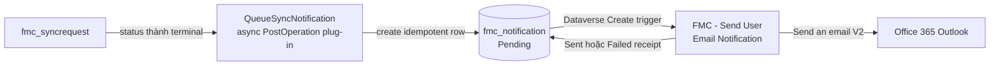
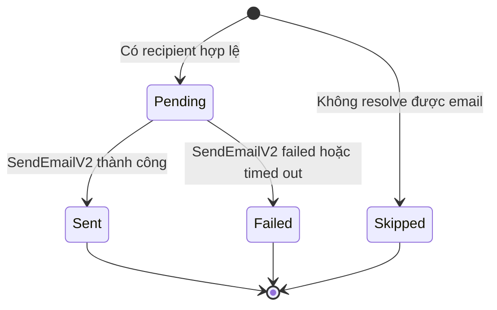
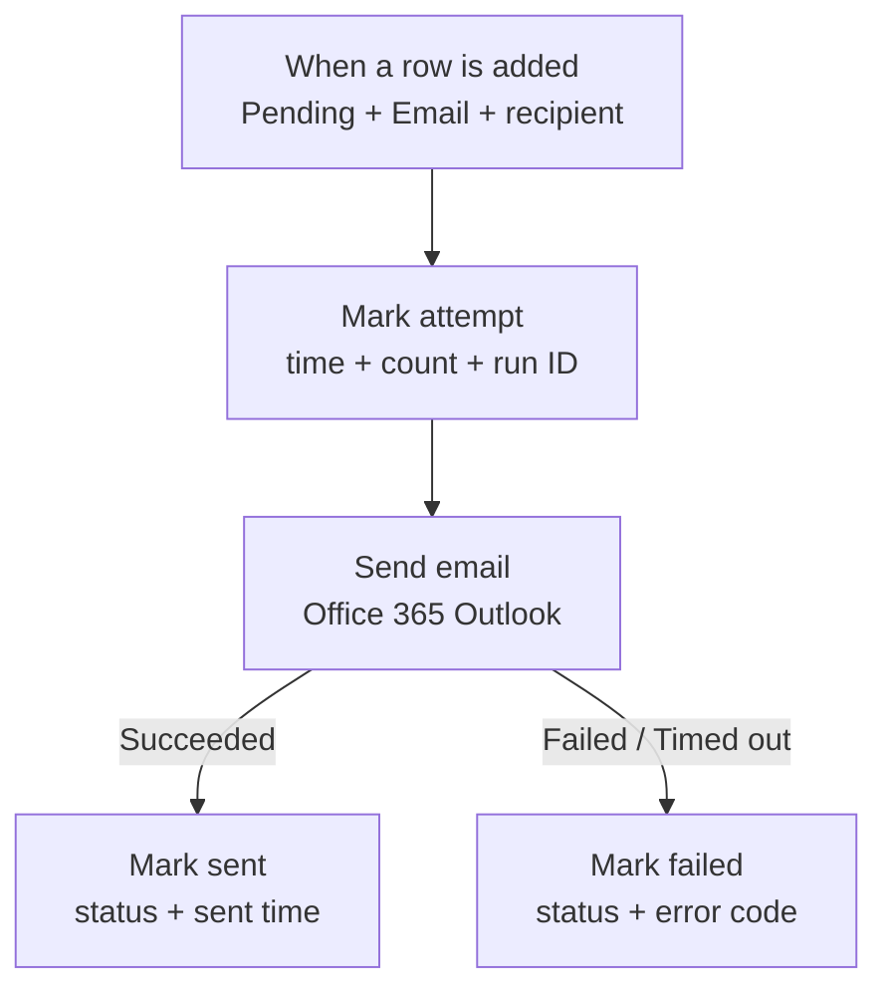

# Dataverse User Email Notifications — hướng dẫn triển khai từng bước

> [!IMPORTANT]
> Tài liệu này mô tả đúng implementation đang dùng trong `FMCentralBms`:
> Dataverse outbox + async plug-in + solution-aware Power Automate flow.
> Email không được gửi trực tiếp trong transaction đồng bộ SQL.

## 0. Bản đồ nhanh

| Bạn muốn làm gì? | Đi tới |
| --- | --- |
| Hiểu kiến trúc trước khi làm | [1. Kiến trúc](#1-kiến-trúc) |
| Tạo table/columns trong Dataverse | [4. Tạo Dataverse notification outbox](#4-tạo-dataverse-notification-outbox) |
| Tạo plug-in sinh notification | [5. Tạo producer plug-in](#5-tạo-producer-plug-in) |
| Tạo Power Automate bằng giao diện | [6. Tạo Power Automate flow bằng Maker Portal](#6-tạo-power-automate-flow-bằng-maker-portal) |
| Deploy bằng script của repo | [7. Deploy lặp lại bằng script](#7-deploy-lặp-lại-bằng-script) |
| Test end-to-end | [8. Kiểm thử](#8-kiểm-thử) |
| Sửa lỗi | [9. Troubleshooting](#9-troubleshooting) |

### Target của POC

```text
Organization URL: https://org06cbc9ec.crm5.dynamics.com/
Organization ID:  ab191700-b99e-f111-aaa0-000d3a80bb96
Environment ID:   5abcb0e5-99b2-e51f-aa0e-90d84405798b
Solution:         FMCentralBms
Publisher prefix: fmc
```

> [!CAUTION]
> Các GUID/receipt trong tài liệu là bằng chứng của lần triển khai Developer,
> không phải trạng thái live vĩnh viễn. Luôn kiểm tra environment trước khi chạy
> lệnh mutation. Không copy OAuth token, client secret hoặc connection ID từ
> Developer sang Production.

---

## 1. Kiến trúc

### 1.1 Luồng xử lý tổng thể



`fmc_syncrequest` chỉ kết thúc công việc sync. Plug-in tạo một bản ghi outbox
riêng. Power Automate đọc outbox và gửi mail. Vì ba phần tách rời nên:

- lỗi Outlook không rollback một sync đã hoàn tất;
- notification có receipt và lịch sử riêng;
- producer không chứa credential email;
- có thể tái sử dụng outbox cho Submitted, Approved, Rejected, Overdue và
  Escalated ở phase sau.

### 1.2 Trạng thái notification



### 1.3 Flow nhìn trong designer



---

## 2. Thành phần đã có trong repo

| Thành phần | Source |
| --- | --- |
| Dataverse table/columns/key/view/role | [`DataverseProvisioner.cs`](../../Dataverse.SyncWorker/Dataverse.SyncWorker.DataAccess/Services/DataverseProvisioner.cs) |
| Plug-in registration | [`DataversePluginProvisioner.cs`](../../Dataverse.SyncWorker/Dataverse.SyncWorker.DataAccess/Services/DataversePluginProvisioner.cs) |
| Plug-in producer | [`QueueSyncNotification.cs`](../../Dataverse.Plugin/FMCentralBms.Plugins/Plugins/QueueSyncNotification.cs) |
| Outbox/idempotency | [`NotificationOutbox.cs`](../../Dataverse.Plugin/FMCentralBms.Plugins/Services/NotificationOutbox.cs) |
| Subject và HTML body | [`NotificationMessageBuilder.cs`](../../Dataverse.Plugin/FMCentralBms.Plugins/Services/NotificationMessageBuilder.cs) |
| Flow definition/deploy/verify/test | [`provision-user-notification-flow.py`](../../scripts/provision-user-notification-flow.py) |
| Flow definition test | [`test_user_notification_flow.py`](../../scripts/tests/test_user_notification_flow.py) |
| Exported solution source | [`dataverse/FMCentralBms`](../../dataverse/FMCentralBms) |

Khuyến nghị: dùng provisioner và script của repo để tránh logical name, choice
value hoặc flow expression bị lệch. Phần thao tác thủ công bên dưới hữu ích để
hiểu, review hoặc tái tạo flow khi designer thay đổi.

---

## 3. Chuẩn bị

### 3.1 Quyền và kết nối

Người triển khai cần:

- quyền customizer/admin phù hợp trong Dataverse Developer environment;
- quyền tạo/chỉnh solution-aware cloud flow;
- Microsoft Dataverse connection có quyền đọc/ghi `fmc_notification`;
- Office 365 Outlook connection có mailbox được phép gửi email;
- quyền dùng cả connection reference khi bật flow.

Production nên dùng service account hoặc mailbox đã được quản trị phê duyệt,
không để flow phụ thuộc tài khoản cá nhân của developer.

### 3.2 Xác nhận đúng target

Chạy từ `D:\metasys-poc`:

```powershell
pac auth list
pac org who --environment https://org06cbc9ec.crm5.dynamics.com/
```

Chỉ tiếp tục khi output đúng Organization ID ở đầu tài liệu.

### 3.3 Build và test local

```powershell
dotnet build .\MetasysPoc.sln -c Release
py -m pytest .\scripts\tests\test_user_notification_flow.py -q
py -m py_compile .\scripts\provision-user-notification-flow.py
```

DLL dùng để đăng ký plug-in:

```text
Dataverse.Plugin\FMCentralBms.Plugins\bin\Release\net48\FMCentralBms.Plugins.dll
```

Version được flow verification hiện tại yêu cầu: `1.0.0.5`.

---

## 4. Tạo Dataverse notification outbox

### 4.1 Cách khuyến nghị: provision từ source

Lệnh này tạo/cập nhật schema, key, default view và quyền solution-aware:

```powershell
dotnet run `
  --project .\Dataverse.SyncWorker\Dataverse.SyncWorker.App\Dataverse.SyncWorker.App.csproj `
  -c Release --no-build -- --provision
```

Provisioner phải tạo được:

- standard table `fmc_notification`;
- organization ownership;
- alternate key `fmc_notification_correlationkey`;
- view `Active Notifications`;
- Create/Read/Write privilege cho role `FM Central BMS Integration`;
- root component của table trong solution `FMCentralBms`.

### 4.2 Cách thủ công trong Maker Portal

Mở [Power Apps Maker](https://make.powerapps.com/), chọn đúng Developer
environment, sau đó:

1. Chọn **Solutions**.
2. Mở **FMCentralBms**.
3. Chọn **New → Table → Table (advanced properties)**.
4. Điền:

   | Thuộc tính | Giá trị |
   | --- | --- |
   | Display name | `Notification` |
   | Plural name | `Notifications` |
   | Primary column | `Name` |
   | Primary column logical name | `fmc_name` |
   | Primary column max length | `200` |
   | Ownership | `Organization` |
   | Table type | `Standard` |

5. Save table, mở **Schema → Columns**, rồi tạo các column dưới đây.

#### Danh sách column

| Display name | Logical name | Type | Required/limit |
| --- | --- | --- | --- |
| Channel | `fmc_channel` | Choice, local | Required; default Email |
| Delivery Status | `fmc_status` | Choice, local | Required; default Pending |
| Event Type | `fmc_eventtype` | Choice, local | Required |
| Recipient Email | `fmc_recipientemail` | Single line text | 320 |
| Recipient Name | `fmc_recipientname` | Single line text | 200 |
| Subject | `fmc_subject` | Single line text | 300 |
| Email Body | `fmc_body` | Multiple lines text | 10,000 |
| Correlation Key | `fmc_correlationkey` | Single line text | 200 |
| Regarding Table | `fmc_regardingtable` | Single line text | 100 |
| Regarding ID | `fmc_regardingid` | Single line text | 100 |
| Delivery Attempts | `fmc_attempts` | Whole number | min 0 |
| Attempted At | `fmc_attemptedat` | Date and time | User local |
| Sent At | `fmc_sentat` | Date and time | User local |
| Flow Run ID | `fmc_flowrunid` | Single line text | 100 |
| Delivery Error | `fmc_errormessage` | Multiple lines text | 4,000 |

#### Choice values bắt buộc

Các số bên dưới là contract giữa Dataverse, plug-in và flow. Không để Maker tự
sinh số khác mà không đồng thời cập nhật code và flow.

| Choice | Label | Value |
| --- | --- | ---: |
| `fmc_channel` | Email | `789120000` |
| `fmc_status` | Pending | `789121000` |
|  | Sent | `789121001` |
|  | Failed | `789121002` |
|  | Skipped | `789121003` |
| `fmc_eventtype` | Sync succeeded | `789122000` |
|  | Sync completed with issues | `789122001` |
|  | Sync failed | `789122002` |
|  | Submitted | `789122010` |
|  | Approved | `789122011` |
|  | Rejected | `789122012` |
|  | Overdue | `789122013` |
|  | Escalated | `789122014` |

> [!WARNING]
> Nếu giao diện hiện tại không cho nhập explicit numeric value cho local choice,
> dừng cách thủ công và dùng provisioner. Không sửa các constant chỉ để khớp một
> table tạo nhầm trên environment có dữ liệu.

### 4.3 Tạo alternate key chống gửi trùng

Trong table `Notification`:

1. Chọn **Schema → Keys**.
2. Chọn **New key**.
3. Display name: `Notification Correlation Key`.
4. Logical name: `fmc_notification_correlationkey`.
5. Chọn column `Correlation Key (fmc_correlationkey)`.
6. Save và chờ key status thành **Active**.

Correlation key hiện có dạng:

```text
syncrequest:<request-guid-khong-dau-gach>:status:<terminal-choice-value>
```

Một request có thể đi qua nhiều terminal status, nhưng mỗi cặp
`request + status` chỉ tạo tối đa một notification.

### 4.4 View và security role

View `Active Notifications` nên hiển thị:

```text
Name | Delivery Status | Event Type | Recipient Email | Attempted At | Sent At
```

Role `FM Central BMS Integration` cần tối thiểu Organization-level
Create/Read/Write trên `fmc_notification`. Người vận hành chỉ xem receipt có thể
dùng role read-only riêng; không cấp quyền sửa status nếu không cần.

---

## 5. Tạo producer plug-in

### 5.1 Vai trò của producer

`QueueSyncNotification` chạy khi `fmc_syncrequest.fmc_status` được update. Nó chỉ
xử lý ba terminal state:

- `Succeeded`;
- `CompletedWithIssues`;
- `Failed`.

Plug-in resolve recipient theo thứ tự:

1. `fmc_requestedby` nếu đã là email hợp lệ;
2. `fmc_requestedby` nếu là Dataverse user GUID;
3. `createdby.internalemailaddress`;
4. nếu vẫn không có email, tạo receipt `Skipped` và không trigger gửi mail.

HTML body được escape trước khi lưu để request name/error không chèn HTML tùy ý.

### 5.2 Đăng ký bằng project provisioner

Sau khi build solution:

```powershell
dotnet run `
  --project .\Dataverse.SyncWorker\Dataverse.SyncWorker.App\Dataverse.SyncWorker.App.csproj `
  -c Release --no-build -- --register-plugin
```

Step phải có cấu hình chính xác:

| Thuộc tính | Giá trị |
| --- | --- |
| Name | `BMS: Queue notification on Sync Request completion` |
| Message | `Update` |
| Primary table | `fmc_syncrequest` |
| Filtering attributes | `fmc_status` |
| Stage | `PostOperation (40)` |
| Mode | `Asynchronous (1)` |
| Plug-in type | `FMCentralBms.Plugins.QueueSyncNotification` |

> [!IMPORTANT]
> Không đổi step thành synchronous. Email/outbox delivery không được làm chậm
> hoặc rollback transaction hoàn tất sync.

---

## 6. Tạo Power Automate flow bằng Maker Portal

### 6.1 Tạo connection references trước

Mở [Power Automate](https://make.powerautomate.com/), chọn đúng environment:

1. Chọn **Solutions → FMCentralBms**.
2. Chọn **New → More → Connection reference**.
3. Tạo hoặc kiểm tra hai reference:

| Mục đích | Display name | Logical name | Connector |
| --- | --- | --- | --- |
| Dataverse | FM Central Microsoft Dataverse | `fmc_sharedcommondataserviceforapps` | Microsoft Dataverse |
| Gửi mail | FM Central Office 365 Outlook | `fmc_sharedoffice365outlook` | Office 365 Outlook |

Với Outlook, chọn connection của mailbox/service account được phép gửi mail.
Nếu tạo connection mới, chọn **Refresh** rồi chọn connection vừa tạo.

> [!NOTE]
> Connection chứa thông tin đăng nhập thật; connection reference chỉ là thành
> phần solution trỏ tới connection. Khi import sang environment khác phải map
> reference sang connection của environment đích.

### 6.2 Tạo flow trong solution

1. Vẫn trong `FMCentralBms`, chọn
   **New → Automation → Cloud flow → Automated**.
2. Flow name: `FMC - Send User Email Notification`.
3. Chọn trigger **Microsoft Dataverse — When a row is added, modified or deleted**.
4. Chọn **Create**.

Tạo flow từ bên trong solution để flow dùng connection references và đi cùng
solution khi export/import.

### 6.3 Cấu hình trigger

Đổi tên card thành `When a pending email notification is created`, rồi điền:

| Field | Giá trị |
| --- | --- |
| Change type | `Added` |
| Table name | `Notifications` (`fmc_notification`) |
| Scope | `Organization` |
| Select columns | để trống |
| Filter rows | biểu thức bên dưới |

```text
fmc_status eq 789121000 and fmc_channel eq 789120000 and fmc_recipientemail ne null
```

Không thêm `$filter=` vào đầu biểu thức.

Mở **Settings** của trigger:

1. Bật **Concurrency control**.
2. Đặt **Degree of parallelism = 10**.
3. Save.

Filter bảo đảm `Skipped`, `Sent`, `Failed` hoặc row không có recipient không bao
giờ gọi Outlook.

### 6.4 Action 1 — Mark attempt

Thêm action **Microsoft Dataverse — Update a row**, đổi tên thành
`Mark attempt`:

| Field | Giá trị |
| --- | --- |
| Table name | `Notifications` |
| Row ID | expression bên dưới |
| Attempted At | `utcNow()` |
| Delivery Attempts | expression tăng attempt |
| Flow Run ID | expression lấy run name |
| Delivery Error | expression `null` |

**Row ID**

```text
triggerOutputs()?['body/fmc_notificationid']
```

**Delivery Attempts**

```text
add(coalesce(triggerOutputs()?['body/fmc_attempts'], 0), 1)
```

**Flow Run ID**

```text
workflow()?['run']?['name']
```

Mỗi expression phải được nhập ở tab **Expression**, không nhập như plain text.

### 6.5 Action 2 — Send email

Thêm action **Office 365 Outlook — Send an email (V2)** sau `Mark attempt`, đổi
tên thành `Send email`:

| Field | Dynamic content từ trigger |
| --- | --- |
| To | `Recipient Email` / `fmc_recipientemail` |
| Subject | `Subject` / `fmc_subject` |
| Body | `Email Body` / `fmc_body` |
| Importance | `Normal` |

Mở **Settings → Retry policy → None**.

Retry được tắt có chủ đích: nếu Outlook đã nhận request nhưng response bị mất,
retry tự động có thể gửi email trùng. Khi thất bại, operator đọc receipt và
requeue có kiểm soát.

### 6.6 Nhánh thành công — Mark sent

Sau `Send email`, thêm action **Microsoft Dataverse — Update a row**, đổi tên
thành `Mark sent`:

| Field | Giá trị |
| --- | --- |
| Table name | `Notifications` |
| Row ID | `triggerOutputs()?['body/fmc_notificationid']` |
| Delivery Status | `Sent` (`789121001`) |
| Sent At | `utcNow()` |
| Delivery Error | expression `null` |

Mở **Configure run after** và chỉ chọn **is successful** cho `Send email`.

### 6.7 Nhánh lỗi — Mark failed

Tạo parallel branch trực tiếp sau `Send email`, thêm
**Microsoft Dataverse — Update a row**, đổi tên thành `Mark failed`:

| Field | Giá trị |
| --- | --- |
| Table name | `Notifications` |
| Row ID | `triggerOutputs()?['body/fmc_notificationid']` |
| Delivery Status | `Failed` (`789121002`) |
| Delivery Error | nội dung bên dưới |

```text
EMAIL-001 Office 365 Outlook delivery failed. Inspect the Power Automate run by fmc_flowrunid.
```

Trong **Configure run after**:

- bỏ chọn **is successful**;
- chọn **has failed**;
- chọn **has timed out**;
- không chọn **is skipped**.

### 6.8 Save, Flow checker và bật flow

1. Chọn **Save**.
2. Mở **Flow checker** và xử lý toàn bộ connection/required-field error.
3. Quay lại flow details, kiểm tra card **Solutions** có `FMCentralBms`.
4. Chọn **Turn on**.
5. Kiểm tra cả Dataverse và Outlook action đang dùng đúng connection reference,
   không phải connection rời ngoài solution.

Checklist designer cuối cùng:

- [ ] Flow nằm trong `FMCentralBms`.
- [ ] Trigger là Create/Added, scope Organization.
- [ ] Filter rows dùng đúng ba điều kiện và numeric choice values.
- [ ] Mark attempt chạy trước Send email.
- [ ] Send email retry policy = None.
- [ ] Mark sent chỉ chạy khi Succeeded.
- [ ] Mark failed chỉ chạy khi Failed hoặc Timed out.
- [ ] Flow đang On.

---

## 7. Deploy lặp lại bằng script

Đây là đường triển khai chính xác theo source của repo.

### 7.1 Liệt kê Outlook connection

```powershell
pac connection list --environment https://org06cbc9ec.crm5.dynamics.com/
```

### 7.2 Tạo/cập nhật Outlook connection reference

```powershell
py .\scripts\provision-user-notification-flow.py `
  bootstrap-reference `
  --outlook-connection-id <connection-id-cua-environment-dich>
```

Không bỏ tham số này khi triển khai sang environment khác.

### 7.3 Render, deploy và verify

```powershell
py .\scripts\provision-user-notification-flow.py render
py .\scripts\provision-user-notification-flow.py deploy
py .\scripts\provision-user-notification-flow.py verify
```

`render` đọc live metadata để lấy entity set name thật
(`fmc_notifications`) và ghi artifact vào `.artifacts/user-notifications`.
`deploy` từ chối chạy nếu artifact không còn khớp definition hiện tại.

Flow phải active với tên:

```text
FMC - Send User Email Notification
```

---

## 8. Kiểm thử

### 8.1 Test trực tiếp outbox → flow → email

```powershell
py .\scripts\provision-user-notification-flow.py test
```

Script tạo một row `Pending` cho email của Dataverse user hiện tại và chờ tối đa
55 giây. Pass khi receipt có:

```text
fmc_status    = 789121001   # Sent
fmc_attempts  = 1
fmc_sentat    != null
fmc_flowrunid != null
```

Kiểm tra cả Inbox và Junk với subject:

```text
[FMC BMS] Notification smoke test
```

### 8.2 Test producer plug-in → outbox → flow → email

```powershell
py .\scripts\provision-user-notification-flow.py test-producer
```

Test này không chạy SQL ingestion. Nó tạo một Sync Request cô lập rồi chuyển
status sang `Succeeded`. Kết quả phải có đúng một notification theo correlation
key và status cuối là `Sent`.

### 8.3 Test bằng SQL sync thật

1. Mở worker:

   ```powershell
   .\START-SQL-TO-DATAVERSE.cmd
   ```

2. Trong `FMC BMS Demo`, bấm **Request BMS Sync**, hoặc chạy flow
   `FMC - Request SQL to Dataverse Sync`.
3. Chờ `fmc_syncrequest.fmc_status` thành Succeeded,
   CompletedWithIssues hoặc Failed.
4. Mở table `Notifications` và xác nhận:
   - `Regarding Table = fmc_syncrequest`;
   - `Regarding ID` bằng request ID;
   - correlation key chứa request ID và terminal status;
   - status là Sent, Failed hoặc Skipped;
   - chỉ có một row cho cùng correlation key.
5. Mở flow **Run history**, tìm run có ID bằng `fmc_flowrunid`.

> [!NOTE]
> `Sent` chứng minh connector action thành công; nó không chứng minh người nhận
> đã mở hoặc đọc email.

---

## 9. Troubleshooting

| Hiện tượng | Điểm kiểm tra đầu tiên | Cách xử lý |
| --- | --- | --- |
| Không có outbox row | Plug-in step/trace | Xác nhận step active, async PostOperation, filter `fmc_status`; xem Plugin Trace Log |
| Row thành `Skipped` | Recipient | Kiểm tra `fmc_requestedby`, `createdby` và `systemuser.internalemailaddress` |
| Row mãi `Pending` | Trigger callback | Flow phải On; filter choice value đúng; connection reference Dataverse hợp lệ |
| `attempts = 0` | Flow chưa nhận event | Kiểm tra trigger run history và callback registration |
| `attempts = 1`, status `Failed` | Outlook action | Mở run bằng `fmc_flowrunid`; kiểm tra mailbox policy, DLP, connector permission |
| Có mail nhưng update receipt lỗi | Dataverse Write privilege | Cấp Write trên `fmc_notification` cho flow owner/service identity |
| Flow không bật được | Connection ownership | Owner phải sở hữu hoặc được phép dùng cả Dataverse và Outlook connections |
| Gửi trùng | Correlation/key hoặc retry | Kiểm tra alternate key Active, correlation key ổn định và retry policy = None |
| Import xong flow Off | Connection mapping | Map connection references trong import wizard rồi Turn on |

<details>
<summary><strong>Flow không trigger dù row đúng Pending</strong></summary>

Kiểm tra theo thứ tự:

1. Row được **Create** mới hay chỉ Update? Flow hiện trigger khi Added/Create.
2. `fmc_status` có đúng `789121000` không?
3. `fmc_channel` có đúng `789120000` không?
4. `fmc_recipientemail` có null/rỗng không?
5. Flow có đang On và nằm đúng environment không?
6. Có nhiều callback active cùng table gây lỗi/duplicate không?
7. Connection reference Dataverse có connection thật không?

</details>

<details>
<summary><strong>Không nên xử lý Failed bằng cách sửa row về Pending ngay</strong></summary>

Việc sửa lại status có thể không trigger flow vì flow hiện nghe Create, không
nghe Update. Requeue cần một thao tác có chủ đích: tạo notification mới với
correlation key mới hoặc bổ sung retry command được thiết kế riêng. Không xóa
receipt Failed để che mất lịch sử.

</details>

---

## 10. ALM và Production checklist

### 10.1 Export source solution

Export vào thư mục tạm trước để không ghi đè local worktree đang có thay đổi:

```powershell
pac solution export `
  --name FMCentralBms `
  --path .\.artifacts\notification-solution\FMCentralBms.zip `
  --managed false `
  --environment https://org06cbc9ec.crm5.dynamics.com/

pac solution unpack `
  --zipfile .\.artifacts\notification-solution\FMCentralBms.zip `
  --folder .\.artifacts\notification-solution\unpacked `
  --packagetype Unmanaged
```

Review tối thiểu:

- `Entities/fmc_notification`;
- flow JSON `FMC-SendUserEmailNotification-...`;
- connection references;
- plug-in assembly/type/step;
- `Other/Solution.xml` root components.

### 10.2 Trước khi lên Production

- [ ] Dùng application/service identity và mailbox đã được duyệt.
- [ ] Connection references được map sang connection Production.
- [ ] Flow owner không phải tài khoản developer sắp hết hạn.
- [ ] Security role chỉ có quyền cần thiết.
- [ ] DLP policy cho phép Dataverse và Office 365 Outlook cùng flow.
- [ ] Test recipient được giới hạn trước khi mở gửi thật.
- [ ] Run history/receipt có quy trình monitoring và support owner.
- [ ] Capacity/licensing và giới hạn connector được xác nhận cho tải dự kiến.
- [ ] Export/import solution đã được test ở environment trung gian.

---

## 11. Kết quả triển khai Developer đã ghi nhận

Receipt ngày 2026-09-16:

- table standard `fmc_notification` và alternate key
  `fmc_notification_correlationkey`;
- plug-in assembly `FMCentralBms.Plugins` version `1.0.0.5`;
- async step `926528c5-73b1-f111-aaad-00224819a344`;
- flow `FMC - Send User Email Notification`, ID
  `23cc5a60-0e28-4afd-8226-042dfeab84d4`, active tại thời điểm kiểm tra;
- Outlook connection reference `fmc_sharedoffice365outlook`;
- direct outbox test và full producer-chain test đều đạt `Sent`, attempts = 1.

Receipt này không thay thế kiểm tra live:

```powershell
py .\scripts\provision-user-notification-flow.py verify
```

---

## 12. Microsoft Learn tham khảo

- [Create a cloud flow in a solution](https://learn.microsoft.com/en-us/power-automate/create-flow-solution)
- [Trigger flows when a row is added, modified, or deleted](https://learn.microsoft.com/en-us/power-automate/dataverse/create-update-delete-trigger)
- [Use a connection reference in a solution](https://learn.microsoft.com/en-us/power-apps/maker/data-platform/create-connection-reference)
- [Employ robust error handling](https://learn.microsoft.com/en-us/power-automate/guidance/coding-guidelines/error-handling)
- [Create flows for popular email scenarios](https://learn.microsoft.com/en-us/power-automate/email-top-scenarios)
